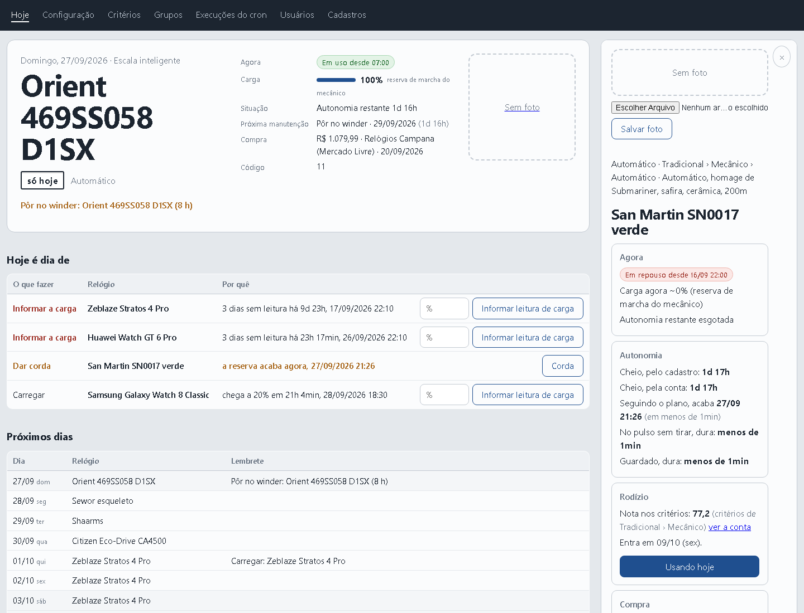
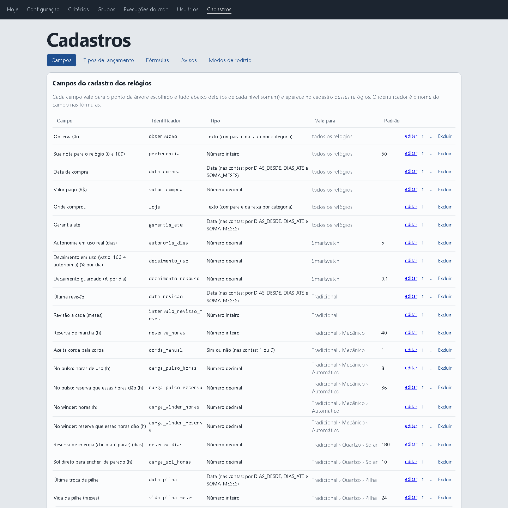
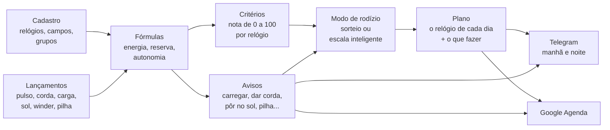
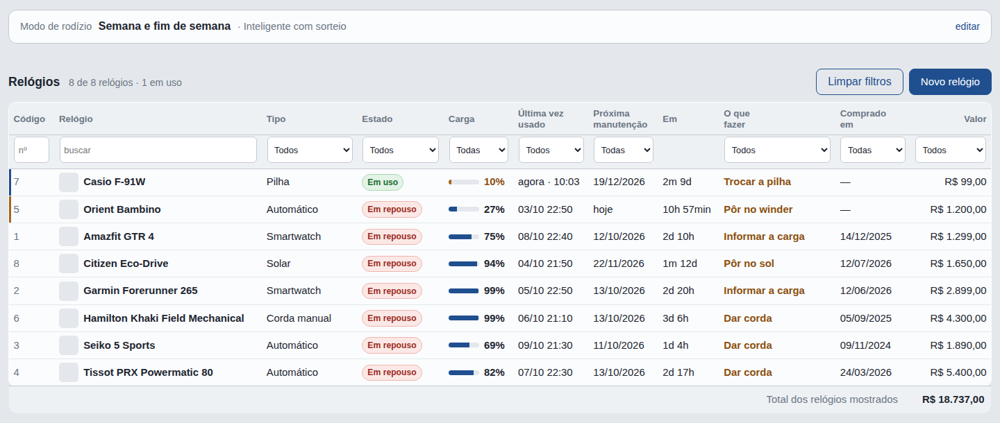
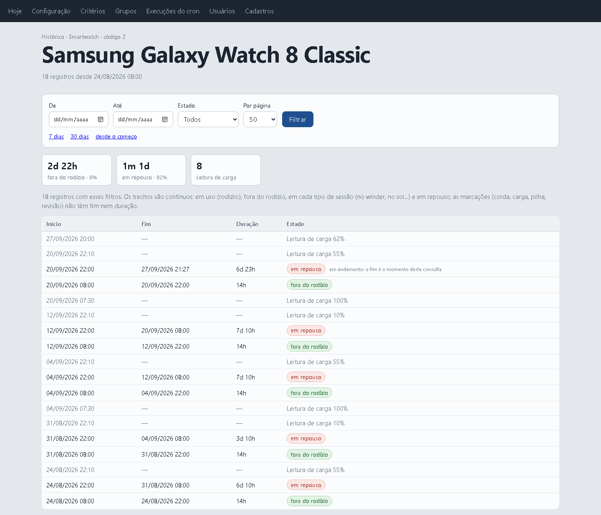

# ⌚ Relojoeiro — Relógios 2

> **O rodízio inteligente de uma coleção de relógios.** Todo dia ele diz qual relógio vai para o pulso, lembra de dar corda,
> carregar, pôr no sol e trocar a pilha, e faz a coleção inteira ser usada, e não só o favorito.


[](#licença)



<sub>A página **Hoje** com uma coleção real de 14 relógios: o do dia (o Orient automático, com o lembrete de pôr no winder), o
que fazer hoje, a escala inteligente dos próximos dias e, à direita, o painel do San Martin.</sub>

| | |
|---|---|
| **[Por que existe](#por-que-isso-existe)** · [A ideia central](#a-ideia-central-o-sistema-não-sabe-nada-de-relógios) · [Como funciona](#como-funciona) · [Um dia com ele](#um-dia-com-o-relógios-2) | **[Experimente em 1 minuto](#experimente-em-1-minuto)** · [As telas](#as-telas) · [A API](#a-api-uma-porta-só-para-tudo) · [Instalação](#instalação) |
| [Perguntas frequentes](#perguntas-frequentes) · [Como é por dentro](#como-é-por-dentro) | [Como contribuir](#como-contribuir) · [Licença](#licença) · [In English](#in-english) |

---

## Por que isso existe

Quem coleciona relógios conhece a cena:

- **O favorito vai para o pulso todo dia**, e aquele que você comprou com tanto carinho está na gaveta há dois meses.
- **O automático para** porque ninguém o usou no fim de semana, e lá vai você acertar hora, data e fase da lua de novo.
- **O solar descarrega no escuro** da caixa, sem você perceber.
- **A pilha acaba sem aviso**, justo no relógio que você queria usar hoje.
- **O smartwatch amanhece sem bateria** no dia em que era a vez dele.
- **A revisão do mecânico** ("a cada 5 anos") e **a garantia** ("vence em março?") ficam na memória, ou seja, em lugar nenhum.

Planilha resolve metade: ela lembra, mas não decide. O **Relógios 2** decide. Ele sabe quanto tempo cada relógio está parado,
quanto de carga ele tem agora, quanto você gosta dele e quanto ele foi usado em relação ao resto. Com isso ele monta o plano
dos próximos dias, ou dos próximos dois anos, já com os lembretes no lugar certo.

De manhã chega uma mensagem no Telegram: *"Hoje: Seiko 5. Dar corda no Orient (a reserva acaba às 15h)."*
À noite chega outra: *"Amanhã: Xiaomi Band. Carregar antes de dormir: chega a 20% amanhã às 14h."*
E no Google Agenda estão a troca de pilha do Casio em novembro e a revisão do Tissot em 2027.

## A ideia central: o sistema não sabe nada de relógios

Essa é a decisão de projeto mais importante, e é o que torna o sistema útil para qualquer coleção. **O código só tem mecanismos;
todo o conhecimento sobre relógios é cadastro.**

Ele não "sabe" que um automático tem reserva de marcha, nem que um solar carrega no sol. Isso tudo está escrito em fórmulas
cadastradas, que você lê, edita e testa pela tela:

```text
Reserva que sobra no mecânico =
  ACUMULA(0; reserva_horas; 1;                                  ← começa em 0, máximo é a reserva, perde 1 h por hora
          "pulso";  carga_pulso_reserva / carga_pulso_horas;    ← cada hora no pulso recarrega tanto
          "winder"; carga_winder_reserva / carga_winder_horas;  ← cada hora no winder, tanto
          "corda";  reserva_horas)                              ← dar corda enche
```

Quer registrar a "troca de pulseira", um "banho ultrassônico" ou um campo "resistência à água"? É cadastro. Quer que os
cronógrafos tenham peso diferente no sorteio? É cadastro. Quer um aviso de "trocar a pulseira de couro a cada ano"? Também.

O sistema já vem com um conjunto inicial completo (smartwatch, automático, corda manual, pilha e solar, com as fórmulas, os
avisos e os critérios de cada um), que você ajusta à sua coleção.



<sub>Os campos do cadastro. Cada um vale para um grupo e tudo abaixo dele (a reserva de marcha só nos mecânicos, a vida da
pilha só nos de pilha), e o identificador é o nome que ele tem nas fórmulas.</sub>

---

## Como funciona



### Os conceitos, um por um

| Conceito | O que é | Exemplo |
|---|---|---|
| **Grupos** (a árvore) | A classificação da coleção, em quantos níveis você quiser. Tudo o que é cadastrado num grupo vale para ele e para tudo abaixo dele. | `Tradicional › Mecânico › Automático` |
| **Campos** | Os dados de cada relógio, definidos por você: texto, número, data, sim/não ou lista, com unidade e valor padrão. | `reserva_horas = 40 h`, `data_pilha`, `loja` |
| **Tipos de lançamento** | O que acontece com um relógio. Pode ser **instantâneo** (corda, troca de pilha), **com valor** (leitura de carga: 68%) ou uma **sessão** com início e fim (no pulso, no winder, no sol). | `sol`: sessão que fecha sozinha às 18h se você esquecer |
| **Fórmulas** | Contas sobre os campos e os lançamentos. A mesma fórmula pode ter **uma versão por grupo**, e vale a do grupo mais perto do relógio. | `energia` é a bateria no smartwatch, a reserva no mecânico, a luz no solar e a vida da pilha no quartzo |
| **Avisos** | Uma data prevista por fórmula, uma antecedência, um texto e o lançamento que resolve o aviso. | *"Dar corda no Orient: a reserva acaba às 15h"*, e o botão **Corda** resolve |
| **Critérios** | Como cada relógio ganha uma nota de 0 a 100 para o sorteio: parâmetros com peso, subparâmetros que medem um campo ou fórmula, e faixas que transformam o valor em nota. | *Tempo sem uso* (40%): de 0 a 1 dia vale nota 0, 30 dias ou mais vale 100 |
| **Modos de rodízio** | As regras do plano: blocos de dias da semana, de que grupo sortear, um relógio por dia ou um para o bloco inteiro, relógio fixo e a forma de escolha. | *"Smartwatch de segunda a sexta, um tradicional por dia no fim de semana"* |
| **Plano** | O relógio de cada dia, com o que fazer (*carregar antes*, *dar corda*, *pôr no winder*). | `seg 06/10 · Xiaomi Band · carregar antes de usar` |

### O motor de fórmulas

As fórmulas são escritas como numa planilha, com `;` separando os argumentos. Além do básico (`SE`, `E`, `OU`, `MIN`, `MAX`,
`LIMITA`, `ARREDONDA`, `PADRAO`, `VAZIO`, `HOJE`, `AGORA`, `DIAS_ATE`, `SOMA_MESES`...), o motor tem funções que leem o
histórico de cada relógio:

| Função | O que devolve |
|---|---|
| `HORAS("pulso"; 30)` | horas no pulso nos últimos 30 dias |
| `CONTAR("pulso"; 30)` | quantos dias com uso nos últimos 30 dias |
| `DIAS_DESDE_ULTIMO("pulso")` | dias desde a última vez no pulso |
| `ULTIMO_VALOR("carga")` / `ULTIMA_DATA("pilha")` | a última leitura / a data do último lançamento |
| `HORAS_APOS("pulso"; "carga")` | horas no pulso desde a última leitura de carga |
| `ACUMULA(início; máx; perda/h; "tipo"; efeito; ...)` | um saldo que percorre o histórico: perde com o tempo e ganha com cada lançamento |
| `MEDIDO("uso")` / `MEDIDO("repouso")` | o gasto real de bateria, medido pelas suas leituras de carga |
| `MEDIA_COLECAO("uso_30d")` | a média de uma variável na coleção inteira |
| `CONFIG("sol_limiar")` | um número da Configuração |

Na página **Cadastros** toda fórmula tem o botão **Testar em todos os relógios**, que mostra o resultado em cada relógio antes
de gravar.

### A nota de cada relógio (critérios)

Os critérios que vêm prontos, para todos os relógios:

| Parâmetro | Peso | Mede |
|---|---:|---|
| Tempo sem uso | 40 | dias desde a última vez no pulso: quanto mais parado, maior a nota |
| Equilíbrio de uso | 30 | uso nos últimos 30 dias comparado com a média da coleção: quem foi pouco usado sobe |
| Preferência | 20 | a sua nota para o relógio (0 a 100) |
| Novidade e valor | 10 | há quanto tempo foi comprado e quanto custou (aproveitar o investimento) |

Cada grupo, e até cada relógio, pode ter o seu próprio conjunto. O smartwatch, por exemplo, também pesa a **energia** (a carga
agora e quantos dias ela aguenta), para não sortear um relógio que vai morrer ao meio-dia. A página **Critérios** mostra a
conta inteira de cada nota: cada faixa, cada peso e cada ponto.

E existe uma **garantia de rodízio**: nenhum relógio passa de N dias parado (21 por padrão).

### Os modos de rodízio

Um modo é feito de **blocos de dias da semana**. Cada bloco diz de onde sortear (um grupo, a coleção toda ou um relógio fixo)
e se é **um relógio por dia** ou **um para o bloco inteiro**. Vêm prontos:

- **Um por semana**: um tradicional a semana toda.
- **Semana e fim de semana**: o smartwatch de segunda a sexta e um tradicional por dia no sábado e no domingo.
- **Por dia da semana**: um relógio diferente a cada dia.
- **Aleatório todo dia**.
- **Escala inteligente**: veja abaixo.

A escolha dentro do bloco pode ser pela **maior nota**, por **sorteio pela nota** (a nota vira a chance), **aleatória** ou por
**fila** (quem está esperando há mais tempo). Com o **ciclo** ligado, um relógio só volta depois que todos os disponíveis do
bloco passaram.

### A escala inteligente

É o modo mais completo. Em vez de sortear semana a semana, ele **planeja de 7 dias a 2 anos de uma vez**, simulando dia a dia:

1. calcula a nota de cada relógio com o estado simulado daquele dia;
2. escolhe o relógio; o smartwatch fica no pulso os dias que a bateria aguenta (até 7);
3. simula o uso (a sessão no pulso no horário de uso) e o efeito dele na carga e na reserva de todos;
4. confere os avisos: se o escolhido vai precisar de carga ou de corda, anota a ação no dia (*"carregar antes de usar"*) e
   simula o lançamento que a resolve;
5. passa para o dia seguinte.

Toda manhã o cron **replaneja a partir do estado real**. Se você usou outro relógio, esqueceu de carregar ou lançou uma
leitura diferente da prevista, o plano se corrige sozinho.

### Gasto medido pelas leituras

O cadastro do smartwatch diz "dura 5 dias". A realidade discorda, e muda conforme a bateria envelhece. Por isso, **cada leitura
de carga que você lança é comparada com a anterior**: o sistema separa as horas no pulso das horas guardado e calcula o gasto
real, em % por dia de uso e em % por dia guardado. A média das medições dos últimos dias (pesada pelas horas de cada uma) passa
a valer nas previsões, e o histórico mostra a bateria perdendo fôlego com o tempo.

---

## Um dia com o Relógios 2

| Quando | O que acontece |
|---|---|
| **06:30** | O cron faz a rodada da manhã: replaneja a escala, sincroniza o Google Agenda e manda o Telegram com o relógio do dia e os avisos. |
| **07:00** | Começa o horário de uso: o sistema abre sozinho a sessão **no pulso** do relógio do dia (origem `rodizio`). |
| **Durante o dia** | Você abre a página **Hoje** e resolve os avisos com um toque (*Corda*, *Carregar*, *Pôr no sol*). Se trocou de relógio, clica em **Usar o...** e o plano se ajusta. |
| **20:00** | A rodada da noite manda o Telegram: *"Amanhã: ... Preparar: carregar hoje à noite."* |
| **22:00** | Fim do horário de uso: a sessão no pulso fecha. Uma sessão esquecida aberta também fecha sozinha na hora cadastrada no tipo. |
| **A cada minuto** | O cron confere se falta montar algum dia do plano e dispara os eventos personalizados no minuto marcado. |

---

## Experimente em 1 minuto

Só precisa do PHP 8.1+ com a extensão `sqlite3`: sem servidor web e sem servidor de banco.

```sh
git clone https://github.com/Challado/relojoeiro.git && cd relojoeiro
cp config.exemplo.php config.php
```

No `config.php`, troque duas linhas para usar o SQLite (o arquivo do banco fica ao lado da pasta):

```php
define("DB_TIPO", "sqlite");
define("DB_ARQUIVO", __DIR__ . "/../relogios.sqlite");
```

```sh
php instalar.php              # a estrutura e o conjunto inicial
php criar_usuario.php voce    # pede a senha
php -S localhost:8000         # e abra http://localhost:8000
```

Cadastre alguns relógios em **Hoje → Novo relógio**. Para montar a escala sem esperar o cron, rode `php cron.php --forcar`.

> O servidor embutido do PHP (`php -S`) é só para experimentar: ele entrega qualquer arquivo da pasta, inclusive o
> `config.php`. Para usar de verdade, siga a [Instalação](#instalação).

---

## As telas



<sub>A tabela da coleção, na página Hoje: tipo, estado, carga ou reserva agora, última vez no pulso, próxima manutenção e o
que fazer, com filtros em cada coluna e o total gasto na coleção.</sub>



<sub>O histórico de um relógio: cada trecho no pulso, em repouso ou no winder, e cada leitura de carga, com o tempo e a
porcentagem em cada estado.</sub>

| Página | Para que serve |
|---|---|
| **Hoje** (`index.php`) | A tela principal. Mostra o relógio do dia, os avisos de hoje (atrasados e em breve) com o botão que resolve cada um, os próximos dias do plano e o modo de rodízio, que se troca ali mesmo. Abaixo fica a tabela da coleção, com filtros e ordenação por tipo, estado, carga, última vez usado, próxima manutenção, data e valor da compra. Clicar num relógio abre o **painel** ao lado. |
| **Painel / Ficha** (`ficha.php`) | Tudo sobre um relógio: foto, estado agora (*"Em repouso desde 21:40"*), carga, nota com a conta, próxima entrada no plano, previsão da bateria, as últimas leituras, a linha do tempo recente, os botões de lançamento e o cadastro completo, editável. |
| **Histórico** (`historico.php`) | A linha do tempo de um relógio: em uso pelo rodízio, no pulso fora do rodízio, no winder, no sol, em repouso, e cada corda, carga e troca de pilha. Mostra quanto tempo e que porcentagem ficou em cada estado, com filtro de período e de estado. |
| **Configuração** (`configuracao.php`) | Os horários (manhã, noite, uso), o Telegram, o Google Agenda, a mensagem padrão de cada canal, a tabela **"O que vai para onde"** (qual aviso sai por qual canal), os eventos personalizados, a prévia **"Como sai hoje"** e o botão que aplica as migrações do banco. |
| **Critérios** (`criterios.php`) | Os conjuntos de critérios por lugar (todos os relógios, um grupo ou um relógio), com parâmetros, subparâmetros, faixas e a nota de cada relógio com a conta aberta. Tem **Restaurar os critérios iniciais**. |
| **Grupos** (`grupos.php`) | A árvore: criar, renomear, mover, ordenar, excluir e escolher o grupo de cada relógio. |
| **Cadastros** (`cadastros.php`) | Campos, tipos de lançamento, fórmulas (com o **Testar**), avisos e modos de rodízio: tudo o que o sistema usa e que não é código. |
| **Execuções do cron** (`execucoes.php`) | O que o cron fez a cada rodada, quanto tempo levou e os erros, com filtros. |
| **Usuários** (`usuarios.php`) | Quem acessa: criar um usuário ou trocar a senha. |

---

## A API: uma porta só para tudo

O `api.php` é o **único back-end**. As páginas são só a tela: o JavaScript de cada uma chama a API e monta o HTML. Por isso,
**tudo o que a tela faz, um script também faz**: automações, atalhos no celular, integração com o Home Assistant, um widget.

**Autenticação:** o token (`X-Api-Token: ...` ou `?token=...`) ou o login do site (HTTP Basic).
**Formato:** JSON por padrão, ou XML com `formato=xml`.

```sh
# tudo o que está no sistema, sem as fotos
curl -u usuario:senha "http://servidor/relojoeiro/api.php?foto=nao"

# o que a página Hoje mostra
curl -H "X-Api-Token: $TOKEN" "http://servidor/relojoeiro/api.php?recurso=hoje"

# os relógios que acabam nas próximas 24 horas, só o nome e quando
curl -u usuario:senha -g "http://servidor/relojoeiro/api.php?recurso=autonomia&f[relogios][acaba_em_segundos][ate]=86400&mostrar[relogios]=nome,acaba_em_datacomtz"

# lançar uma leitura de carga (e medir o gasto)
curl -u usuario:senha -d recurso=lancamento -d acao=lancar -d relogio_id=10 -d tipo=carga -d valor=68 http://servidor/relojoeiro/api.php

# pôr no sol agora... e tirar depois
curl -u usuario:senha -d recurso=lancamento -d acao=iniciar  -d relogio_id=4 -d tipo=sol http://servidor/relojoeiro/api.php
curl -u usuario:senha -d recurso=lancamento -d acao=encerrar -d relogio_id=4 -d tipo=sol http://servidor/relojoeiro/api.php

# testar uma fórmula em dois relógios, sem gravar
curl -u usuario:senha -G "http://servidor/relojoeiro/api.php" -d recurso=calcular --data-urlencode "expressao=energia * 2" -d relogio=10,12
```

**Consultas:** `hoje`, `ficha`, `avisos`, `plano`, `previsao`, `autonomia`, `historico`, `criterios`, `eventos`, `agenda`,
`config`, `cron`, `arvore`, `cadastros`, `usuarios`, `migracoes`, `calcular`, `foto` e `ajuda`.

**Escritas:** relógios, lançamentos, grupos, campos, tipos de lançamento, fórmulas, avisos, critérios, modos, rodízio
(sortear de novo, "estou usando este"), configuração, eventos e usuários, todas com as mesmas validações e mensagens da tela.

**Filtros genéricos** funcionam em qualquer lista de qualquer resposta:

| Parâmetro | Faz |
|---|---|
| `incluir=relogios,plano` / `excluir=motor` | só essas partes, ou todas menos essas |
| `f[lista][campo]=v` | igual a `v` (ou a um de vários: `v1,v2`) |
| `f[lista][campo][de]=` / `[ate]=` | faixa de números ou datas |
| `f[lista][campo][contem]=` / `[diferente]=` / `[vazio]=1` | texto, exclusão, vazio |
| `busca[lista]=texto` | o texto em qualquer campo |
| `ordem[lista]=-campo` | ordena (o `-` inverte) |
| `limite[lista]=20&pagina[lista]=2` | paginação |
| `mostrar[lista]=id,nome` | só esses campos |

Os campos aninhados funcionam com ponto, como `formulas.energia.valor`, `campos.loja.valor` e `compra.valor`. Textos são
comparados sem diferenciar maiúsculas e acentos.

📖 **A documentação completa** (cada consulta, cada escrita com exemplo e o dicionário de todos os campos das respostas) está no
cabeçalho do [`api.php`](api.php) e na própria API: `api.php?recurso=ajuda`.

---

## Instalação

**Requisitos:** PHP 8.1+ com `curl` e `openssl` (este só para o Google Agenda), um servidor web (nginx ou Apache), o cron e
**um destes bancos**, cada um pela extensão nativa do PHP:

| Banco | Extensão do PHP | Versão | Quando escolher |
|---|---|---|---|
| **SQLite** | `sqlite3` | 3.35+ (testado no 3.53) | o mais simples: um arquivo só, sem servidor de banco. Sobra para uma coleção pessoal, até num Raspberry Pi |
| **MySQL / MariaDB** | `mysqli` | com utf8mb4 (testado no MariaDB 11.4) | a hospedagem já tem, ou você já usa |
| **PostgreSQL** | `pgsql` | 12+, com ICU, o padrão (testado no 18) | você já tem um Postgres rodando |

O sistema se comporta igual nos três. Isso é conferido pelo teste de paridade ([`testes/`](testes/)), que roda o mesmo
roteiro nos três bancos e compara tudo o que a API devolve.

```sh
# 1. o código
git clone https://github.com/Challado/relojoeiro.git /var/www/relojoeiro
cd /var/www/relojoeiro

# 2. a configuração: o banco (DB_TIPO), o token da API, o fuso, as mensagens
cp config.exemplo.php config.php
nano config.php

# 3. o banco vazio (só no MySQL e no Postgres; o SQLite cria o arquivo sozinho)
#    MySQL:    mysql -u root -p -e "CREATE DATABASE relogios2 CHARACTER SET utf8mb4 COLLATE utf8mb4_unicode_ci"
#    Postgres: createdb -U postgres relogios2

# 4. a instalação: a estrutura e o conjunto inicial, traduzidos para o banco do config.php
php instalar.php

# 5. o primeiro usuário (a senha é pedida sem aparecer)
php criar_usuario.php seu_login

# 6. o cron, a cada minuto (ele é mudo: não escreve nada e não manda e-mail)
( crontab -l; echo "* * * * * php /var/www/relojoeiro/cron.php" ) | crontab -
```

No SQLite, ponha o arquivo do banco (`DB_ARQUIVO`) **fora da pasta que o servidor web publica**, numa pasta em que o
usuário do PHP possa escrever (o SQLite cria ao lado os arquivos `-wal` e `-shm`).

**7. O servidor web.** O [`nginx-relogios.conf`](nginx-relogios.conf) tem um bloco pronto que deixa abrir só as páginas e o
`api.php`, e bloqueia o núcleo, o banco, a configuração, o cron, os scripts, os testes e os arquivos `.sql`, `.json`, `.md` e
`.sqlite`. **Não deixe `config.php`, `lib.php` nem `banco.php` acessíveis pela web.** No Apache, faça o equivalente com
`<FilesMatch>`.

**8. Abra no navegador** e entre com o usuário criado. O conjunto inicial já está lá: cadastre seus relógios em
**Hoje → Novo relógio**, escolha o grupo de cada um e preencha os campos.

### O `config.php`

| Constante | Para quê |
|---|---|
| `DB_TIPO` | o banco: `mysql` (o padrão, vale para o MariaDB), `pgsql` ou `sqlite` |
| `DB_HOST`, `DB_PORTA`, `DB_NOME`, `DB_USUARIO`, `DB_SENHA` | o servidor do banco (MySQL e Postgres); `DB_PORTA` 0 é a porta padrão |
| `DB_ARQUIVO` | o arquivo do banco (SQLite), fora da pasta publicada |
| `API_TOKEN` | **obrigatório**, com 10 caracteres ou mais. Sem ele o sistema inteiro para e diz por quê. |
| `FUSO` | o fuso horário, como `America/Sao_Paulo`. Vazio ou ausente: o do PHP (`date.timezone` no php.ini). Vale para tudo, inclusive para as datas que o banco grava |
| `MSG_ENDPOINT`, `MSG_DESTINATARIO`, `MSG_TITULO` | as mensagens (veja abaixo). Sem o endereço, nada é enviado. |

### Mensagens pelo Telegram

O sistema não fala direto com a API do Telegram: ele chama **um endereço HTTP seu** (`MSG_ENDPOINT`) com
`?destinatario=...&titulo=...&mensagem=...` e considera enviado se a resposta for 2xx. Isso deixa você usar o seu bot, um
webhook, o n8n, o Home Assistant ou qualquer ponte de mensagens. Mensagens longas são divididas em partes. Na
**Configuração** há os botões **Enviar agora** (manhã e noite) para testar.

### Google Agenda

1. No Google Cloud, crie uma **conta de serviço** e baixe a chave JSON.
2. Guarde a chave **no servidor, fora da pasta pública e fora do repositório** (o `.gitignore` já bloqueia os nomes comuns).
3. Compartilhe a sua agenda com o e-mail da conta de serviço, com permissão de alterar eventos.
4. Na **Configuração**, informe o ID da agenda e o caminho da chave, ligue a agenda e clique em **Sincronizar agora**.

O sistema cria, atualiza e remove só os eventos que ele mesmo criou, sem duplicar. A rotina (carregar, corda, sol) entra
dentro da janela de antecedência, e a manutenção (pilha, revisão, garantia) entra em qualquer data.

### Atualizações do banco

Depois de atualizar o código, se houver migração nova (`migracao_v*.sql`), a API responde `503` e a página **Configuração**
mostra o botão para aplicá-la. O cron também para e registra o motivo, em vez de rodar pela metade. Numa instalação nova, o
`schema.sql` já traz todas as migrações.

O `schema.sql` e cada migração são **um arquivo só para os três bancos**: a estrutura (`CREATE TABLE`, `ALTER TABLE`) é
escrita no dialeto do MySQL, e o [`banco.php`](banco.php) traduz para o Postgres e o SQLite (`AUTO_INCREMENT`, `ENUM`,
`TINYINT`, `DATETIME`, os `INDEX` dentro da tabela, o `AFTER` e o `MODIFY COLUMN`, que no SQLite refaz a tabela). Os dados
(`INSERT`, `UPDATE`) vão em SQL comum aos três: nada de `GROUP_CONCAT`, `IF()` ou `FIND_IN_SET`. `INSERT IGNORE`,
`REPLACE INTO`, `NOW()`, `LEAST`, `<=>` e `CONCAT` podem (o `CONCAT` sem argumento NULL: no Postgres o NULL vira texto
vazio, no MySQL o resultado vira NULL). As migrações v2 a v8 são de antes disso e existem só para atualizar bancos MySQL
antigos: um banco Postgres ou SQLite já nasce na versão atual.

### Diferenças entre os bancos que você pode notar

- **Maiúsculas e acentos:** como no MySQL, "Relógio" e "RELOGIO" são o mesmo nome, na busca, na ordem e no login. No
  Postgres, isso vem de uma collation ICU (`ci`) que o `instalar.php` cria. No SQLite, de uma função do PHP; por isso, num
  programa de fora (o `sqlite3` da linha de comando, o DB Browser), ordenar ou comparar essas colunas dá o erro "no such
  collation sequence: ci". Ler e exportar funciona normalmente.
- **A ordem das colunas** de uma migração com `AFTER` só vale no MySQL: nos outros a coluna nova vai para o fim da tabela
  (muda só a ordem das chaves no JSON da API).
- **Os ids** podem pular números diferentes em cada banco (o MySQL reserva ids em bloco em alguns `INSERT ... SELECT`).

### Vindo do sistema anterior

`php importar.php <banco_antigo>` traz a árvore, os relógios, as fotos, os usuários, os campos e todo o histórico (convertido
em lançamentos). Com `--substituir`, apaga antes o que já existe neste banco. [`PORTE.md`](PORTE.md) e
[`PARIDADE.md`](PARIDADE.md) registram, item por item, como cada comportamento do sistema antigo foi portado.

---

## Perguntas frequentes

**Preciso lançar tudo à mão?**
Não. O uso do relógio do dia é registrado sozinho, no horário de uso. Você só lança o que o sistema não tem como saber: a corda,
a leitura de carga do smartwatch, o sol, o winder, a troca de pilha e o dia em que usou outro relógio. E cada aviso já traz o
botão que o resolve.

**E se eu não quiser usar o relógio sorteado?**
Clique em **Usar o...** no relógio que você colocou. O plano passa a considerar esse e se refaz a partir dali. Também dá para
**Sortear de novo** a partir de hoje ou de amanhã.

**Um relógio está no conserto.**
Desmarque **Disponível** no cadastro. Ele sai do sorteio e das médias da coleção, mas o histórico continua.

**Tenho um tipo de relógio que o sistema não conhece (um kinetic, um relógio de bolso...).**
Crie um grupo para ele, os campos, os tipos de lançamento e uma versão da fórmula `energia` nesse grupo. Os avisos e os
critérios dos grupos de cima continuam valendo, e você sobrescreve só o que for diferente.

**O automático não aceita corda pela coroa.**
Desmarque o campo **Aceita corda pela coroa**: o aviso vira **Pôr no winder** em vez de **Dar corda**, e a escala simula uma
noite no winder para resolver.

**Posso usar só a API, sem as telas?**
Pode. As telas usam exatamente a mesma API.

---

## Como é por dentro

- **PHP 8.1+ puro, com SQLite, MySQL/MariaDB ou PostgreSQL.** Sem framework, sem Composer e sem dependências, para rodar em
  qualquer hospedagem com PHP. Cada banco pela extensão nativa do PHP (`sqlite3`, `mysqli`, `pgsql`); o SQL do sistema é
  escrito uma vez só e o [`banco.php`](banco.php) traduz o que muda de um banco para outro.
- **Motor de fórmulas próprio**, com análise sintática, funções de histórico, versões por grupo e dependências entre fórmulas.
- **Simulação:** a escala e as previsões simulam lançamentos futuros e recalculam as fórmulas dia a dia, sem gravar nada.
- **Front-end em HTML e JavaScript puro.** Cada página PHP só confere o login e entrega o esqueleto; o `.js` dela chama a API e
  monta a tela. Os scripts levam a data do arquivo na URL, para o cache do navegador não servir uma versão antiga.
- **Cron mudo e rastreável:** roda a cada minuto, não escreve na saída e registra cada execução no banco (sem atividade, 7 dias;
  com atividade ou erro, 1 ano). Um erro fatal vai para o banco ou, se nem o banco responder, para um arquivo temporário.
- **Falha segura:** sem token válido ou com o banco desatualizado, o sistema para e explica o motivo, em vez de rodar pela metade.

### Arquivos

| Arquivo | O que é |
|---|---|
| [`api.php`](api.php) | a API: toda leitura e escrita, com a documentação completa no cabeçalho |
| [`lib.php`](lib.php) | o núcleo: login, árvore, motor de fórmulas, avisos, critérios, rodízio, escala, mensagens, agenda |
| [`banco.php`](banco.php) | o banco: a conexão com o MySQL, o Postgres ou o SQLite, e a tradução do SQL de um para outro |
| [`operacoes.php`](operacoes.php) | as regras de cada gravação: validações e mensagens |
| [`cron.php`](cron.php) | o plano, a sessão do dia, as rodadas da manhã e da noite, os eventos e a agenda |
| `index.php`, `ficha.php`, `historico.php`, `configuracao.php`, `criterios.php`, `grupos.php`, `cadastros.php`, `execucoes.php`, `usuarios.php` | as páginas (só o esqueleto) |
| [`pagina.php`](pagina.php) | o login do site e o menu |
| `api.js`, `hoje.js`, `painel.js`, `tabela.js`, `foto.js`, ... | as telas, montadas no navegador a partir da API |
| [`estilo.css`](estilo.css) | o visual |
| [`schema.sql`](schema.sql) | a estrutura do banco e o conjunto inicial (grupos, campos, fórmulas, avisos, modos, critérios) |
| `migracao_v2.sql` … `migracao_v8.sql` | as migrações, aplicadas pela página Configuração |
| [`config.exemplo.php`](config.exemplo.php) | o modelo do `config.php` |
| [`instalar.php`](instalar.php) | instala o `schema.sql` no banco do `config.php`, qualquer um dos três |
| [`criar_usuario.php`](criar_usuario.php) | cria um usuário ou troca a senha, pela linha de comando |
| [`importar.php`](importar.php) | importa os dados do sistema anterior |
| [`nginx-relogios.conf`](nginx-relogios.conf) | o bloco do nginx que protege os arquivos internos |
| [`testes/`](testes/) | o teste de paridade: o mesmo roteiro pela API em cada banco, e o comparador das respostas |
| [`docs/telas/`](docs/telas/) | as capturas de tela deste README |
| [`PORTE.md`](PORTE.md), [`PARIDADE.md`](PARIDADE.md) | o registro do porte da versão anterior |

---

## Como contribuir

Melhorias são bem-vindas, e o caminho é sempre este repositório:

1. Para uma mudança grande, **abra uma issue antes** e conte o que pretende: evita trabalho que não vai entrar.
2. Faça um fork no GitHub, crie uma branch e faça a mudança. O fork serve só para preparar a proposta (veja a
   [licença](#licença)).
3. **Siga o jeito do código:** PHP e JavaScript puros, sem dependências, comentários e mensagens em português. O que é
   conhecimento sobre relógios vai para o cadastro (`schema.sql`), não para o código.
4. Mudou o banco? Crie uma `migracao_vN.sql` e registre em `$MIGRACOES` no `lib.php`: a estrutura no dialeto do MySQL, os
   dados em SQL comum aos três bancos (veja [Atualizações do banco](#atualizações-do-banco)).
5. **Rode o teste de paridade** ([`testes/`](testes/)) nos três bancos antes de mandar: o resultado tem de ser
   `0 diferenças graves`.
6. Abra o pull request contando o que muda para quem usa e como você testou.

---

## Licença

O Relojoeiro é **código-fonte disponível**, não software livre: o código está à vista, mas tem dono e regras de uso. Em
resumo (o que vale é o texto do [`LICENSE`](LICENSE)):

| ✅ Pode | ❌ Não pode |
|---|---|
| instalar e usar para você, a sua família ou a sua empresa | criar um projeto novo baseado neste código, no todo ou em parte, nem reescrito em outra linguagem |
| alterar o código da sua instalação | distribuir o código, original ou alterado, fora deste repositório |
| propor melhorias por pull request aqui | oferecer o sistema como serviço para outras pessoas |
| fazer fork no GitHub para preparar essas propostas | manter um fork como projeto separado |

Para qualquer outro uso, peça autorização pelo GitHub ([Challado](https://github.com/Challado)).

> 💡 **Contribua, não copie.** Ser contribuidor do Relojoeiro é muito melhor que fazer um fork: a sua melhoria entra para
> todos, com o seu nome no histórico, e você não corre risco nenhum. Já um fork que vira projeto próprio viola a licença,
> e os direitos sobre este código são defendidos: pedido de remoção nas plataformas, ação judicial com indenização e até
> ação penal (a Lei 9.609/98 trata a violação de direito de autor de software como crime). Mesmo quem acha que está certo
> pode ter de se defender, e isso custa tempo e advogado. **Na dúvida, pergunte antes:** a resposta é de graça, a
> discussão depois não é.

---

## In English

**Relojoeiro** ("watchmaker") is a self-hosted rotation planner for watch collections. Every day it picks which watch goes on
your wrist, scoring each one by the criteria you set (days unworn, balance of use, your preference, battery or power reserve),
and it can plan weeks or months ahead by simulating each watch's charge day by day. It reminds you, by Telegram and Google
Calendar, to wind the automatic, charge the smartwatch, put the solar in the sun and replace the battery, and it learns each
smartwatch's real battery drain from your readings. Everything about watches (types, fields, formulas, alerts) is data you
edit, not code. PHP 8.1+ with SQLite, MySQL/MariaDB or PostgreSQL, no dependencies, and a complete REST API
(`api.php?recurso=ajuda`).

The interface and the documentation are in Portuguese. The code is **source-available, not open source**: you may install,
use and modify it for yourself, and contribute back through pull requests, but you may not publish derived projects or
redistribute it (see [`LICENSE`](LICENSE), in Portuguese). Contributions are welcome.

---

<p align="center"><sub>Feito para quem tem mais relógios do que pulsos. ⌚</sub></p>
