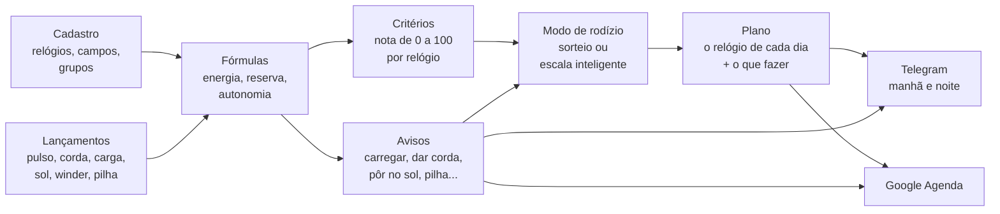
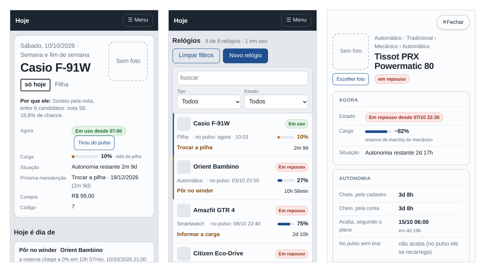

# ⌚ Relojoeiro — Relógios 2

> **O rodízio inteligente de uma coleção de relógios.** Todo dia ele diz qual relógio vai para o pulso, lembra de dar corda,
> carregar, pôr no sol e trocar a pilha, e faz a coleção inteira ser usada, e não só o favorito.


[](#licença)


<sub>A página **Hoje** com uma coleção real de 14 relógios: o do dia (o Orient automático, com o lembrete de pôr no winder), o
que fazer hoje, a escala inteligente dos próximos dias e, à direita, o painel do San Martin.</sub>

| | |
|---|---|
| **[Por que existe](#por-que-isso-existe)** · [A ideia central](#a-ideia-central-o-sistema-não-sabe-nada-de-relógios) · [Como funciona](#como-funciona) · [Um dia com ele](#um-dia-com-o-relógios-2) | **[Experimente em 1 minuto](#experimente-em-1-minuto)** · [As telas](#as-telas) · [A API](#a-api-uma-porta-só-para-tudo) · [Instalação](#instalação) |
| [Perguntas frequentes](#perguntas-frequentes) · [Como é por dentro](#como-é-por-dentro) | [Como contribuir](#como-contribuir) · [Licença](#licença) · [In English](#in-english) |

---

## Por que isso existe

Quem coleciona relógios conhece a cena:

- **O favorito vai para o pulso todo dia**, e aquele que você comprou com tanto carinho está na gaveta há dois meses.
- **O automático para** porque ninguém o usou no fim de semana, e lá vai você acertar hora, data e fase da lua de novo.
- **O solar descarrega no escuro** da caixa, sem você perceber.
- **A pilha acaba sem aviso**, justo no relógio que você queria usar hoje.
- **O smartwatch amanhece sem bateria** no dia em que era a vez dele.
- **A revisão do mecânico** ("a cada 5 anos") e **a garantia** ("vence em março?") ficam na memória, ou seja, em lugar nenhum.

Planilha resolve metade: ela lembra, mas não decide. O **Relógios 2** decide. Ele sabe quanto tempo cada relógio está parado,
quanto de carga ele tem agora, quanto você gosta dele e quanto ele foi usado em relação ao resto. Com isso ele monta o plano
dos próximos dias, ou dos próximos dois anos, já com os lembretes no lugar certo.

De manhã chega uma mensagem no Telegram: *"Hoje: Seiko 5. Dar corda no Orient (a reserva acaba às 15h)."*
À noite chega outra: *"Amanhã: Xiaomi Band. Carregar antes de dormir: chega a 20% amanhã às 14h."*
E no Google Agenda estão a troca de pilha do Casio em novembro e a revisão do Tissot em 2027.

## A ideia central: o sistema não sabe nada de relógios

Essa é a decisão de projeto mais importante, e é o que torna o sistema útil para qualquer coleção. **O código só tem mecanismos;
todo o conhecimento sobre relógios é cadastro.**

Ele não "sabe" que um automático tem reserva de marcha, nem que um solar carrega no sol. Isso tudo está escrito em fórmulas
cadastradas, que você lê, edita e testa pela tela:

```text
Reserva que sobra no mecânico =
  ACUMULA(0; reserva_horas; 1;                                  ← começa em 0, máximo é a reserva, perde 1 h por hora
          "pulso";  carga_pulso_reserva / carga_pulso_horas;    ← cada hora no pulso recarrega tanto
          "winder"; carga_winder_reserva / carga_winder_horas;  ← cada hora no winder, tanto
          "corda";  reserva_horas)                              ← dar corda enche
```

Quer registrar a "troca de pulseira", um "banho ultrassônico" ou um campo "resistência à água"? É cadastro. Quer que os
cronógrafos tenham peso diferente no sorteio? É cadastro. Quer um aviso de "trocar a pulseira de couro a cada ano"? Também.

O sistema já vem com um conjunto inicial completo (smartwatch, automático, corda manual, pilha e solar, com as fórmulas, os
avisos e os critérios de cada um), que você ajusta à sua coleção.


<sub>Os campos do cadastro. Cada um vale para um grupo e tudo abaixo dele (a reserva de marcha só nos mecânicos, a vida da
pilha só nos de pilha), e o identificador é o nome que ele tem nas fórmulas.</sub>

---

## Como funciona



### Os conceitos, um por um

| Conceito | O que é | Exemplo |
|---|---|---|
| **Grupos** (a árvore) | A classificação da coleção, em quantos níveis você quiser. Tudo o que é cadastrado num grupo vale para ele e para tudo abaixo dele. | `Tradicional › Mecânico › Automático` |
| **Campos** | Os dados de cada relógio, definidos por você: texto, número, data, sim/não ou lista, com unidade e valor padrão. | `reserva_horas = 40 h`, `data_pilha`, `loja` |
| **Tipos de lançamento** | O que acontece com um relógio. Pode ser **instantâneo** (corda, troca de pilha), **com valor** (leitura de carga: 68%) ou uma **sessão** com início e fim (no pulso, no winder, no sol). | `sol`: sessão que fecha sozinha às 18h se você esquecer |
| **Fórmulas** | Contas sobre os campos e os lançamentos. A mesma fórmula pode ter **uma versão por grupo**, e vale a do grupo mais perto do relógio. | `energia` é a bateria no smartwatch, a reserva no mecânico, a luz no solar e a vida da pilha no quartzo |
| **Avisos** | Uma data prevista por fórmula, uma antecedência, um texto e o lançamento que resolve o aviso. | *"Dar corda no Orient: a reserva acaba às 15h"*, e o botão **Corda** resolve |
| **Limite de carga** | A carga em que o relógio precisa de atenção: carregar o smartwatch, pôr o solar no sol, dar corda no mecânico. O aviso só sai quando a carga chega a ele. Cada relógio pode ter o seu (campo *"Avisar quando a carga chegar a"*); vazio, vale o geral da Configuração. | smartwatch em 20% (o geral), o Samsung em 30% (o dele) |
| **Critérios** | Como cada relógio ganha uma nota de 0 a 100 para o sorteio: parâmetros com peso, subparâmetros que medem um campo ou fórmula, e faixas que transformam o valor em nota. | *Tempo sem uso* (40%): de 0 a 1 dia vale nota 0, 30 dias ou mais vale 100 |
| **Modos de rodízio** | As regras do plano: blocos de dias da semana, de que grupo sortear, um relógio por dia ou um para o bloco inteiro, relógio fixo e a forma de escolha. | *"Smartwatch de segunda a sexta, um tradicional por dia no fim de semana"* |
| **Plano** | O relógio de cada dia, com o que fazer (*carregar antes*, *dar corda*, *pôr no winder*). | `seg 06/10 · Xiaomi Band · carregar antes de usar` |

### O motor de fórmulas

As fórmulas são escritas como numa planilha: números com vírgula ou ponto, textos entre aspas, `;` separando os argumentos,
as operações `+ - * / ^` e as comparações `= <> < <= > >=` (que dão 1 ou 0). Um valor vazio se propaga pela conta, e a divisão
por zero dá vazio. O básico:

| Função | O que devolve |
|---|---|
| `SE(condição; se verdadeira; se falsa)`, `E(...)`, `OU(...)`, `NAO(x)` | a lógica: `E` dá 1 se todas são verdadeiras, `OU` se alguma é, `NAO` inverte |
| `MIN(...)`, `MAX(...)` | o menor e o maior dos valores (ignoram os vazios) |
| `LIMITA(x; mín; máx)`, `ARREDONDA(x; casas)`, `ABS(x)` | x preso na faixa; arredondado; sem sinal |
| `PADRAO(x; outro)`, `VAZIO(x)`, `NADA()` | x, ou o outro se x estiver vazio; 1 se x está vazio; o vazio, de propósito (`SE(condição; NADA(); conta)`) |
| `HOJE()`, `AGORA()` | a data de hoje e o instante de agora, em dias (o agora com a fração do dia) |
| `DIAS_DESDE(data)`, `DIAS_ATE(data)`, `SOMA_MESES(data; meses)` | dias desde e até uma data (negativo: já passou); a data somada de meses, pelo calendário |
| `HORAS_USO()` | as horas de um dia de uso, pelo horário de uso da Configuração (das 7h às 22h: 15) |
| `CONFIG("chave")` | um número da Configuração, como `CONFIG("sol_limiar")` |

E as que leem o histórico de cada relógio:

| Função | O que devolve |
|---|---|
| `HORAS("pulso"; 30)` | horas no pulso nos últimos 30 dias |
| `CONTAR("pulso"; 30)` | quantos dias com uso nos últimos 30 dias |
| `DIAS_DESDE_ULTIMO("pulso")` | dias desde a última vez no pulso |
| `ULTIMO_VALOR("carga")` / `ULTIMA_DATA("pilha")` | a última leitura / a data do último lançamento |
| `HORAS_APOS("pulso"; "carga")` | horas no pulso desde a última leitura de carga |
| `ACUMULA(início; máx; perda/h; "tipo"; efeito; ...)` | um saldo que percorre o histórico: perde com o tempo e ganha com cada lançamento |
| `MEDIDO("uso")` / `MEDIDO("repouso")` | o gasto real de bateria, medido pelas suas leituras de carga |
| `EM_SESSAO("winder")` | 1 se a sessão está aberta agora (o relógio está no winder) |
| `MEDIA_COLECAO("uso_30d")` | a média de uma variável na coleção inteira |

Na página **Cadastros** toda fórmula tem o botão **Testar em todos os relógios**, que mostra o resultado em cada relógio antes
de gravar.

### A nota de cada relógio (critérios)

Os critérios que vêm prontos, para todos os relógios:

| Parâmetro | Peso | Mede |
|---|---:|---|
| Tempo sem uso | 40 | dias desde a última vez no pulso: quanto mais parado, maior a nota |
| Equilíbrio de uso | 30 | uso nos últimos 30 dias comparado com a média da coleção: quem foi pouco usado sobe |
| Preferência | 20 | a sua nota para o relógio (0 a 100) |
| Novidade e valor | 10 | há quanto tempo foi comprado e quanto custou (aproveitar o investimento) |

Cada grupo, e até cada relógio, pode ter o seu próprio conjunto. O smartwatch, por exemplo, também pesa a **energia** (a carga
agora e quantos dias ela aguenta), para não sortear um relógio que vai morrer ao meio-dia. A página **Critérios** mostra a
conta inteira de cada nota: cada faixa, cada peso e cada ponto.

Os conjuntos que vêm prontos, completos. A nota de um parâmetro é a média das notas dos subparâmetros, pelo peso de cada um; a
nota do relógio é a média dos parâmetros, pelo peso. Cada subparâmetro lê uma variável (um campo ou uma fórmula) e dá a nota
pela faixa em que o valor cai; o subparâmetro sem valor (um campo vazio, um valor fora de toda faixa) fica de fora, e os outros
dividem o peso dele. Tudo se edita na página **Critérios**, e **Restaurar os critérios iniciais** volta a estes.

**Todos os relógios**

| Parâmetro | Peso | Subparâmetro (a variável, o peso dentro do parâmetro) | As faixas: o valor → a nota |
|---|---:|---|---|
| Tempo sem uso | 40 | Dias sem uso (`dias_sem_uso`) | 0 a 1 → 0; 1 a 3 → 30; 3 a 7 → 60; 7 a 14 → 80; 14 a 30 → 95; 30 ou mais → 100 |
| Equilíbrio de uso | 30 | Uso nos últimos 30 dias, comparado com a média (`uso_vs_media`) | 0 a 25 → 100; 25 a 60 → 80; 60 a 100 → 60; 100 a 140 → 35; 140 a 200 → 15; 200 ou mais → 0 |
| Preferência | 20 | Sua nota para o relógio (`preferencia`) | 0 a 20 → 0; 20 a 40 → 25; 40 a 60 → 50; 60 a 80 → 75; 80 a 100 → 100 |
| Novidade e valor | 10 | Novidade: dias desde a compra (`dias_desde_compra`, 60) | 0 a 15 → 100; 15 a 45 → 80; 45 a 120 → 55; 120 a 365 → 40; 365 ou mais → 30 |
|  |  | Aproveitar o investimento: valor pago (`valor_compra`, 40) | 0 a 300 → 30; 300 a 800 → 50; 800 a 1500 → 70; 1500 ou mais → 90 |

**Smartwatch**

| Parâmetro | Peso | Subparâmetro (a variável, o peso dentro do parâmetro) | As faixas: o valor → a nota |
|---|---:|---|---|
| Energia | 30 | Carga agora (%) (`energia`, 50) | 0 a 15 → 0; 15 a 30 → 25; 30 a 50 → 55; 50 a 80 → 85; 80 a 100 → 100 |
|  |  | Dias de uso que a carga aguenta (`dias_de_carga`, 50) | 0 a 1 → 0; 1 a 2 → 30; 2 a 4 → 60; 4 a 7 → 85; 7 ou mais → 100 |
| Autonomia | 15 | Autonomia do smartwatch (`autonomia_dias`) | 0 a 2 → 10; 2 a 4 → 40; 4 a 7 → 70; 7 a 14 → 90; 14 ou mais → 100 |
| Tempo sem uso | 25 | Dias sem uso (`dias_sem_uso`) | 0 a 1 → 0; 1 a 3 → 30; 3 a 7 → 60; 7 a 14 → 80; 14 a 30 → 95; 30 ou mais → 100 |
| Equilíbrio de uso | 15 | Uso nos últimos 30 dias, comparado com a média (`uso_vs_media`) | 0 a 25 → 100; 25 a 60 → 80; 60 a 100 → 60; 100 a 140 → 35; 140 a 200 → 15; 200 ou mais → 0 |
| Preferência | 10 | Sua nota para o relógio (`preferencia`) | 0 a 20 → 0; 20 a 40 → 25; 40 a 60 → 50; 60 a 80 → 75; 80 a 100 → 100 |
| Novidade e valor | 5 | Novidade: dias desde a compra (`dias_desde_compra`, 60) | 0 a 15 → 100; 15 a 45 → 80; 45 a 120 → 55; 120 a 365 → 40; 365 ou mais → 30 |
|  |  | Aproveitar o investimento: valor pago (`valor_compra`, 40) | 0 a 300 → 30; 300 a 800 → 50; 800 a 1500 → 70; 1500 ou mais → 90 |

**Tradicional › Mecânico**

| Parâmetro | Peso | Subparâmetro (a variável, o peso dentro do parâmetro) | As faixas: o valor → a nota |
|---|---:|---|---|
| Reserva de marcha | 25 | Reserva agora (%): vazia, precisa rodar (`energia`) | 0 a 10 → 100; 10 a 30 → 85; 30 a 60 → 60; 60 a 90 → 35; 90 a 100 → 20 |
| Cuidado mecânico | 15 | Parado precisa rodar (lubrificação) (`dias_sem_uso`, 50) | 0 a 7 → 20; 7 a 30 → 60; 30 a 90 → 90; 90 ou mais → 100 |
|  |  | Revisão em dia (`dias_ate_revisao`, 50) | 0 a 30 → 20; 30 a 180 → 60; 180 ou mais → 100 |
| Tempo sem uso | 25 | Dias sem uso (`dias_sem_uso`) | 0 a 1 → 0; 1 a 3 → 30; 3 a 7 → 60; 7 a 14 → 80; 14 a 30 → 95; 30 ou mais → 100 |
| Equilíbrio de uso | 20 | Uso nos últimos 30 dias, comparado com a média (`uso_vs_media`) | 0 a 25 → 100; 25 a 60 → 80; 60 a 100 → 60; 100 a 140 → 35; 140 a 200 → 15; 200 ou mais → 0 |
| Preferência | 10 | Sua nota para o relógio (`preferencia`) | 0 a 20 → 0; 20 a 40 → 25; 40 a 60 → 50; 60 a 80 → 75; 80 a 100 → 100 |
| Novidade e valor | 5 | Novidade: dias desde a compra (`dias_desde_compra`, 60) | 0 a 15 → 100; 15 a 45 → 80; 45 a 120 → 55; 120 a 365 → 40; 365 ou mais → 30 |
|  |  | Aproveitar o investimento: valor pago (`valor_compra`, 40) | 0 a 300 → 30; 300 a 800 → 50; 800 a 1500 → 70; 1500 ou mais → 90 |

**Tradicional › Quartzo › Pilha**

| Parâmetro | Peso | Subparâmetro (a variável, o peso dentro do parâmetro) | As faixas: o valor → a nota |
|---|---:|---|---|
| Vida da pilha | 15 | Vida da pilha (%) (`energia`) | 0 a 10 → 10; 10 a 30 → 50; 30 a 100 → 70 |
| Revisão | 10 | Revisão em dia (`dias_ate_revisao`) | 0 a 30 → 20; 30 a 180 → 60; 180 ou mais → 100 |
| Tempo sem uso | 35 | Dias sem uso (`dias_sem_uso`) | 0 a 1 → 0; 1 a 3 → 30; 3 a 7 → 60; 7 a 14 → 80; 14 a 30 → 95; 30 ou mais → 100 |
| Equilíbrio de uso | 25 | Uso nos últimos 30 dias, comparado com a média (`uso_vs_media`) | 0 a 25 → 100; 25 a 60 → 80; 60 a 100 → 60; 100 a 140 → 35; 140 a 200 → 15; 200 ou mais → 0 |
| Preferência | 10 | Sua nota para o relógio (`preferencia`) | 0 a 20 → 0; 20 a 40 → 25; 40 a 60 → 50; 60 a 80 → 75; 80 a 100 → 100 |
| Novidade e valor | 5 | Novidade: dias desde a compra (`dias_desde_compra`, 60) | 0 a 15 → 100; 15 a 45 → 80; 45 a 120 → 55; 120 a 365 → 40; 365 ou mais → 30 |
|  |  | Aproveitar o investimento: valor pago (`valor_compra`, 40) | 0 a 300 → 30; 300 a 800 → 50; 800 a 1500 → 70; 1500 ou mais → 90 |

**Tradicional › Quartzo › Solar**

| Parâmetro | Peso | Subparâmetro (a variável, o peso dentro do parâmetro) | As faixas: o valor → a nota |
|---|---:|---|---|
| Luz | 25 | Carga de luz (%) (`energia`) | 0 a 30 → 80; 30 a 70 → 65; 70 a 100 → 50 |
| Revisão | 10 | Revisão em dia (`dias_ate_revisao`) | 0 a 30 → 20; 30 a 180 → 60; 180 ou mais → 100 |
| Tempo sem uso | 30 | Dias sem uso (`dias_sem_uso`) | 0 a 1 → 0; 1 a 3 → 30; 3 a 7 → 60; 7 a 14 → 80; 14 a 30 → 95; 30 ou mais → 100 |
| Equilíbrio de uso | 20 | Uso nos últimos 30 dias, comparado com a média (`uso_vs_media`) | 0 a 25 → 100; 25 a 60 → 80; 60 a 100 → 60; 100 a 140 → 35; 140 a 200 → 15; 200 ou mais → 0 |
| Preferência | 10 | Sua nota para o relógio (`preferencia`) | 0 a 20 → 0; 20 a 40 → 25; 40 a 60 → 50; 60 a 80 → 75; 80 a 100 → 100 |
| Novidade e valor | 5 | Novidade: dias desde a compra (`dias_desde_compra`, 60) | 0 a 15 → 100; 15 a 45 → 80; 45 a 120 → 55; 120 a 365 → 40; 365 ou mais → 30 |
|  |  | Aproveitar o investimento: valor pago (`valor_compra`, 40) | 0 a 300 → 30; 300 a 800 → 50; 800 a 1500 → 70; 1500 ou mais → 90 |

E existe uma **garantia de rodízio**: nenhum relógio passa de N dias parado (21 por padrão). Ela vale **antes** da nota: se
algum candidato já passou do limite, ele ganha direto, o mais tempo parado primeiro. Só quando ninguém passou do limite é
que a nota decide.

Os dias parado são a fórmula **Dias sem uso**, que você pode editar em Cadastros: os dias desde a última vez no pulso e, para
um relógio que **nunca foi usado**, os dias desde a compra (sem data de compra, 9999, o mais parado de todos). Assim um
relógio comprado ontem não fura a fila, e dois nunca usados não empatam: espera há mais tempo o que foi comprado antes.

Para você nunca ficar na dúvida, **cada dia do plano guarda o motivo da escolha**, numa frase, e ela aparece embaixo do
relógio na página Hoje e na página Plano: *"Garantia de rodízio: nunca usado, na coleção há 38 dias, além do limite de 21
dias sem uso"*, *"Sorteio pela nota, entre 5 candidatos: nota 70,2, 16,4% de chance"*, *"A maior nota (91,2)"*, *"O mesmo
relógio da semana no bloco Segunda a sexta"*, *"Escolhido à mão"*.

### Os modos de rodízio

Um modo é feito de **blocos de dias da semana**. Cada bloco diz de onde sortear (um grupo, a coleção toda ou um relógio fixo)
e se é **um relógio por dia** ou **um para o bloco inteiro**. Vêm prontos:

- **Um por semana**: um tradicional a semana toda.
- **Semana e fim de semana**: o smartwatch de segunda a sexta e um tradicional por dia no sábado e no domingo.
- **Por dia da semana**: um relógio diferente a cada dia.
- **Aleatório todo dia**.
- **Escala inteligente**: veja abaixo.

A escolha dentro do bloco pode ser pela **maior nota**, por **sorteio pela nota** (a nota vira a chance), **aleatória** ou por
**fila** (quem está esperando há mais tempo). Com o **ciclo** ligado, um relógio só volta depois que todos os disponíveis do
bloco passaram.

### A escala inteligente

É o modo mais completo. Em vez de sortear semana a semana, ele **planeja de 7 dias a 2 anos de uma vez**, simulando dia a dia:

1. calcula a nota de cada relógio com o estado simulado daquele dia;
2. escolhe o relógio; o smartwatch fica no pulso os dias que a bateria aguenta (até 7);
3. simula o uso (a sessão no pulso no horário de uso) e o efeito dele na carga e na reserva de todos;
4. confere os avisos: se o escolhido vai precisar de carga ou de corda, anota a ação no dia (*"carregar antes de usar"*) e
   simula o lançamento que a resolve;
5. passa para o dia seguinte.

Toda manhã o cron **replaneja a partir do estado real**. Se você usou outro relógio, esqueceu de carregar ou lançou uma
leitura diferente da prevista, o plano se corrige sozinho.

### Gasto medido pelas leituras

O cadastro do smartwatch diz "dura 5 dias". A realidade discorda, e muda conforme a bateria envelhece. Por isso, **cada leitura
de carga que você lança é comparada com a anterior**, e o intervalo entre as duas vira uma medição: quanto caiu, quantas horas
ele passou no pulso e quantas fora do pulso (guardado, desligado). O horário de uso da Configuração conta como pulso sozinho, e
as suas marcações (*Pôs*, *Tirou*) mandam.

Cada medição é uma conta com dois gastos desconhecidos:

```text
queda = dias de uso × gasto em uso + dias fora do pulso × gasto fora do pulso
```

Com as medições dos últimos dias (90, na Configuração), o sistema acha **os dois gastos juntos**: os que melhor explicam todas
as quedas (mínimos quadrados, e cada medição pesa as horas que cobriu). Uma noite entre duas leituras (só fora do pulso) acerta o
gasto fora do pulso; os dias no pulso, já sabendo esse, acertam o gasto em uso. Entra toda medição de 1 hora ou mais, até a sem
queda nenhuma (ela diz que o gasto é pequeno): a curta, em que o arredondamento da leitura (o relógio mostra a carga em números
inteiros) pesa mais, entra com peso pequeno. Quanto mais leituras, mais preciso.

Quando as medições ainda não separam os dois (só leituras com o relógio guardado, por exemplo), vale a média das medições de
cada gasto; sem nenhuma nos últimos dias, as de antes. Os gastos medidos valem no lugar do cadastro nas previsões, e o histórico
mostra a bateria perdendo fôlego com o tempo. Uma subida na leitura é recarga: novo ponto de partida, sem medir.

Não importa se você lança a leitura logo depois do *Tirou* ou logo depois do *Pôs*: a leitura não é "de uso" nem "de repouso".
O que conta é o intervalo até a anterior, dividido pelas marcações minuto a minuto. Uma leitura às 22h05, depois de um dia
inteiro no pulso, mede quase só o gasto em uso; a de 7h05 do dia seguinte mede a noite desligado.

Os dois gastos ficam no quadro **Gasto da bateria**, na ficha do relógio:

- **No pulso** e **Fora do pulso (desligado)**: o gasto que vale na conta, em negrito, e de onde ele vem (medido, com o do
  cadastro ao lado para comparar, ou só do cadastro, quando ainda não há medição).
- **Nos 90 dias antes desses**: os dois gastos medidos na janela anterior. É a comparação que mostra a bateria envelhecendo:
  se o gasto no pulso passou de 4,9% para 5,7%, ela já não segura a carga como antes.

As medições mais velhas que a janela saem da conta sozinhas. Por isso o ajuste ao envelhecimento é automático: não é preciso
mexer no cadastro. O "Decaimento em uso" e o "Decaimento guardado" do cadastro só valem enquanto não há medição.

---

## O cadastro de cada relógio, campo por campo

Todo relógio tem **nome**, **grupo**, **disponível** e **foto**. O resto são **campos**, e quais campos um relógio tem depende
do **grupo** dele: tudo o que é cadastrado num grupo vale para ele e para todos os grupos abaixo. É por isso que "ser
automático" não é uma marcação à parte: é estar no grupo **Automático** (ou num subgrupo dele), e com isso herdar os campos de
pulso e de winder.

```text
(todos os relógios)       Observação, Sua nota, Compra, Garantia, Limite de carga
├── Smartwatch            Autonomia em uso real, Decaimento em uso, Decaimento guardado
└── Tradicional           Última revisão, Revisão a cada
    ├── Mecânico          Reserva de marcha, Aceita corda pela coroa
    │   ├── Automático    No pulso: horas / reserva, No winder: horas / reserva
    │   └── Corda manual  (nada a mais: no pulso ele não se carrega)
    └── Quartzo
        ├── Pilha         Última troca de pilha, Vida da pilha
        └── Solar         Reserva de energia, Sol direto para encher
```

Campo vazio vale o **padrão** do cadastro (a coluna "vazio" nas tabelas abaixo). Os campos, os grupos e os padrões são
cadastro, não código: dá para mudar tudo na página **Cadastros**, e criar os seus.

### O básico do relógio

| Campo | O que é |
|---|---|
| **Nome** | como ele aparece em todo lugar: na tela, no Telegram e na agenda. |
| **Grupo** | o lugar dele na árvore. Decide os campos, as fórmulas (a "carga" de um smartwatch é a bateria; a de um mecânico, a reserva de marcha) e os avisos que ele recebe. |
| **Disponível** | desmarcado, ele sai do rodízio e dos avisos (no conserto, emprestado, vendido), mas o histórico fica. |
| **Guardar no banco a cópia de todos os documentos dele** | marcada, todo arquivo do relógio (o manual, a nota, as fotos, os vídeos) vai também para o banco, como cópia de segurança. Só aparece quando o `config.php` não decide por todos (sem o `DOCUMENTOS_COPIA_BANCO`). Veja [Os documentos do relógio](#os-documentos-do-relógio): é o segundo dos três níveis da cópia. |
| **Foto** | só para a tela. |
| **Documentos** | o manual, a nota fiscal (em PDF e em XML), as fotos de recordação, os vídeos e o que mais for. Veja [Os documentos do relógio](#os-documentos-do-relógio). |

### Os documentos do relógio

Cada relógio guarda **quantos arquivos você quiser**, de qualquer tipo, cada um numa **categoria**: o manual, a nota fiscal em
PDF, o XML da nota, as fotos de recordação, os vídeos, uma planilha, o que for. Cada documento tem:

| Dado | O que é |
|---|---|
| **Categoria** | onde ele fica. As que vêm prontas: **Manual** (`manual`, qualquer arquivo), **Nota fiscal** (`nota_fiscal`, PDF ou imagem), **Nota fiscal (XML)** (`nota_xml`, XML), **Fotos** (`fotos`, imagens), **Vídeos** (`videos`, vídeos) e **Diversos** (`diversos`, qualquer arquivo). Elas são cadastro: crie, renomeie ou apague em **Cadastros → Categorias de documentos**. |
| **Título** | como ele aparece. Vazio no envio: o nome do arquivo. |
| **Data** | a data do documento: a ocasião da foto, o dia do vídeo, a data da nota. Opcional. |
| **Descrição** | um texto livre: *"no casamento do primo"*, *"a primeira troca de pulseira"*. Opcional. |
| **O arquivo** | qualquer arquivo, até o limite do servidor (veja [O tamanho dos envios](#o-tamanho-dos-envios-os-documentos)). |

Na ficha, o quadro **Documentos** mostra quantos o relógio tem em cada categoria; cada categoria, e o botão **Abrir os
documentos**, abrem a página **Documentos** daquele relógio numa aba nova. Lá:

- **Enviar arquivos:** a categoria, o título, a data, a descrição e os arquivos. Dá para escolher **vários de uma vez** (um
  álbum inteiro): eles sobem um por um, com o andamento em porcentagem, e o título, a data e a descrição valem para todos (depois
  cada um se edita sozinho). A categoria só aceita os tipos dela: uma foto não entra em **Vídeos**.
- **Uma aba por categoria**, e **Todos**. Dentro dela, cada arquivo abre **pelo tipo dele**, não pela categoria:
  - **Fotos:** uma galeria de miniaturas. Uma foto abre em **tela cheia**, com a data e a descrição embaixo; troque com as
    setas da tela, as setas do teclado ou deslizando o dedo no celular. **▶ Apresentação** passa sozinha a cada 4 segundos (a
    barra de espaço liga e desliga; Esc fecha). As miniaturas são feitas pelo navegador no envio, por isso a galeria abre rápido
    mesmo com fotos grandes.
  - **Vídeos:** a lista, com uma caixa em cada um e as setas **↑** e **↓** para pôr na ordem. **▶ Assistir os marcados** toca
    os marcados um depois do outro, no player da página, com **Anterior** e **Próximo**. Dá para avançar e voltar dentro do vídeo.
  - **PDF:** **Ver aqui** abre o visualizador de PDF do navegador dentro da página; **Abrir noutra aba** e **Baixar**.
  - **XML:** se for uma **NF-e** (o XML da nota fiscal eletrônica), a página mostra o resumo: o emitente, o número, a série, a
    data, o valor, os produtos e a chave de acesso. E o botão **Baixar o XML**.
  - **Áudio:** o player. **Qualquer outro arquivo:** o botão **Baixar**.
- **Editar** (o título, a data, a categoria, a descrição) e **Excluir**, em cada documento; o das fotos e dos vídeos fica na
  lista **Editar ou excluir fotos e vídeos**, no fim da página.
- No alto, a escolha do relógio: **Todos** mostra os documentos da coleção inteira.

**Onde os arquivos ficam:** numa **pasta do servidor** (o `DOCUMENTOS_PASTA` do `config.php`, fora da pasta publicada), de onde
a página os entrega, **e, se você pedir, também dentro do banco**, inteiros, como cópia de segurança (a tabela
`documento_parte`, em pedaços de 4 MB: assim um vídeo grande não esbarra no limite de um comando do MySQL nem na memória do
PHP). Para o que tem a cópia, **o backup do banco basta**: restaurado o banco num servidor novo, com a pasta vazia, cada
arquivo volta sozinho para a pasta quando é aberto, ou na próxima rodada do cron. Ao recriar, o sistema confere o arquivo pelo SHA-256 guardado no envio; um arquivo que não bate
não é recriado. Um documento que perdeu o arquivo **e** a cópia no banco está perdido: a página avisa, e a rodada da noite do
cron registra quantos são.

**Quem vai para o banco: três níveis**, e o de cima vale sobre os de baixo:

| Nível | Onde se escolhe | O que faz |
|---|---|---|
| 1. **O sistema** | o `DOCUMENTOS_COPIA_BANCO` do `config.php` | `true`: **todo** arquivo, de todo relógio, vai também para o banco. `false`: **nenhum** vai (nem o que o relógio ou o arquivo pedem). Sem a linha: quem decide são os dois níveis de baixo. |
| 2. **O relógio** | a caixa **Guardar no banco a cópia de todos os documentos dele**, no cadastro do relógio (ou o botão **Guardar todos os dele no banco**, na página Documentos dele) | marcada, todo arquivo daquele relógio vai para o banco, os que já estavam e os que vierem. |
| 3. **O arquivo** | a caixa **Guardar a cópia destes arquivos também no banco**, no envio, ou **Guardar a cópia deste arquivo no banco**, em editar | só aquele arquivo vai para o banco. |

**A tela só mostra a escolha de quem decide:** com o `DOCUMENTOS_COPIA_BANCO` no `config.php` (`true` ou `false`), não aparece
nem a caixa do relógio nem a dos arquivos (a página Documentos só diz o que o `config.php` manda); com o relógio guardando
todos, não aparece a caixa dos arquivos dele (nem no envio, nem em editar), só o botão **Só os marcados**, para voltar.

Marcou num nível e o arquivo ainda não tem a cópia: no envio e em editar ela vai na hora; ao marcar o relógio, o cron copia os
arquivos dele aos poucos. Desmarcou e ninguém mais pede: em editar a cópia sai na hora, e pelo relógio o cron a tira aos poucos;
**a cópia só sai se o arquivo da pasta está lá e confere com ela** (o SHA-256), para o documento nunca ficar sem as duas. Os
documentos que já tinham a cópia antes da migração v17 ficaram marcados no próprio arquivo: nada saiu do banco.

O banco cresce o tamanho dos arquivos copiados: um vídeo de 500 MB são 500 MB a mais no banco e no backup dele. Na página, cada
arquivo diz onde está (só na pasta, na pasta e no banco, fora da pasta) e quem pediu a cópia (o `config.php`, o relógio ou o
próprio arquivo).

**A limpeza, pelo cron (a cada minuto):** o arquivo que sumiu da pasta volta do banco; o documento que tem a cópia pedida e
ainda não a tem no banco (o relógio acabou de ser marcado, ou uma cópia que falhou) ganha, e o que tem a cópia e ninguém mais
pede perde (se o arquivo da pasta confere), até 256 MB por minuto; a pasta de um relógio que não
existe mais (`r<número>`) é apagada inteira; e o arquivo da pasta que não é de nenhum documento é apagado (só depois de 10
minutos, porque um envio pode estar no meio). Tudo o que ele faz entra no registro (**Execuções do cron**).

Excluir um documento apaga o arquivo e a cópia no banco; excluir o relógio apaga os documentos dele. Sem a pasta configurada,
a página avisa o que falta e não aceita envios.

Os documentos não entram em nenhuma conta: são para consultar. Os números que o sistema usa (a reserva de marcha, a autonomia,
o tempo de sol para encher...) continuam nos campos do cadastro. O manual que o fabricante publica só como página da internet
(a Casio faz assim) vira PDF pelo próprio navegador: abra a página e use **Imprimir → Salvar como PDF**.

O sistema anterior guardava um manual por relógio numa tabela própria do banco (a migração v13). A migração v16 passa cada
um para os documentos, na categoria **Manual** (com a cópia no banco), e apaga a tabela; o arquivo volta para a pasta sozinho
no minuto seguinte, pelo cron (o mesmo que recupera um arquivo sumido).

### Todos os relógios

| Campo | Vazio | O que é e para que serve |
|---|---|---|
| **Observação** `observacao` | | Texto livre. Não entra em nenhuma conta. |
| **Sua nota para o relógio (0 a 100)** `preferencia` | 50 | O quanto você gosta dele. Entra no critério *Preferência* (peso 20 no conjunto de todos os relógios): nota maior, mais chance no sorteio. |
| **Data da compra** `data_compra` | | Entra no critério *Novidade e valor*: o relógio recém-chegado sobe no sorteio (até 15 dias: nota 100; depois de um ano: 30), para você aproveitar a novidade. |
| **Valor pago** (R$) `valor_compra` | | Também no critério *Novidade e valor* (*aproveitar o investimento*): o mais caro sobe um pouco (até R$ 300: nota 30; acima de R$ 1.500: 90). |
| **Onde comprou** `loja` | | Texto, mostrado no quadro Compra. Não entra em conta. |
| **Garantia até** `garantia_ate` | | Data. O aviso *"Garantia vencendo"* sai 30 dias antes. |
| **Avisar quando a carga chegar a** (%) `carga_minima` | o geral | O **limite de carga** deste relógio: o ponto em que sai o aviso de carregar (smartwatch), de pôr no sol (solar) ou de dar corda/pôr no winder (mecânico). Vazio, vale o geral do tipo: no smartwatch, o da Configuração (*"Carregar quando a carga estimada chegar a"*, 20%); no solar, o do solar na Configuração (70%); no mecânico, 0% (a reserva acabando). Veja [Os avisos de carga](#os-avisos-de-carga). |

### Smartwatch

A "carga" do smartwatch é a bateria, em %. O sistema não lê a bateria do relógio: ela é **estimada** a partir da última
**leitura de carga** que você lançou, descontando o que ele gastou desde então (no pulso e guardado). Sem nenhuma leitura, a
carga fica desconhecida.

| Campo | Vazio | O que é e para que serve |
|---|---|---|
| **Autonomia em uso real** (dias) `autonomia_dias` | 5 | Quantos **dias de uso** a bateria cheia aguenta no seu uso de verdade (não o do fabricante). Dá o gasto em uso: 100 ÷ autonomia. Com 1,5 dia, o gasto é 66,7% por dia de uso. Também decide quantos dias seguidos ele fica na escala inteligente (o que a bateria aguenta, de 1 a 7). |
| **Decaimento em uso** (% por dia) `decaimento_uso` | 100 ÷ autonomia | O gasto em uso, direto. Preenchido, vale no lugar da conta pela autonomia. |
| **Decaimento guardado** (% por dia) `decaimento_repouso` | 0,1 | Quanto ele perde desligado na gaveta. |

Dois detalhes que mudam a conta:

- **"Dia de uso" é o horário de uso da Configuração** (das 7h às 22h: 15 horas), não 24 horas. Quem usa das 7h às 22h e tem
  66,7% por dia de uso gasta 4,4% por hora no pulso.
- **As suas leituras mandam.** Quando há medições do gasto (veja [Gasto medido pelas leituras](#gasto-medido-pelas-leituras)),
  elas valem no lugar dos dois decaimentos. A ordem é: **o medido, senão o informado, senão a conta pela autonomia**. O painel
  do relógio mostra qual está valendo e de onde veio.

Exemplo: a última leitura foi 89% às 23h58 de ontem, e desde então ele ficou guardado por 1,9 dia com 0,1% por dia. A carga
agora é 89 − 0,19 = **88,8%**. Se você puser no pulso agora, com 66,7% por dia de uso, ele chega a 20% em
(88,8 − 20) ÷ 66,7 = 1 dia de uso; guardado, em (88,8 − 20) ÷ 0,1 = 688 dias.

### Tradicional (todos os que não são smartwatch)

| Campo | Vazio | O que é e para que serve |
|---|---|---|
| **Última revisão** `data_revisao` | | Data da última revisão no relojoeiro. Um lançamento de *Revisão* mais recente vale no lugar. |
| **Revisão a cada** (meses) `intervalo_revisao_meses` | | O intervalo entre revisões (um mecânico costuma ser a cada 4 ou 5 anos: 48 ou 60). O aviso *"Revisão"* sai 30 dias antes e vai para a agenda. Vazio: nenhum aviso. |

### Mecânico (automático e corda manual)

A "carga" do mecânico é a **reserva de marcha que sobra**, em horas (e em %, da reserva cheia).

| Campo | Vazio | O que é e para que serve |
|---|---|---|
| **Reserva de marcha** (h) `reserva_horas` | 40 | Quanto tempo o relógio **anda sozinho, com a corda cheia, até parar**: o tanque dele. Vem na especificação do calibre (*power reserve*): Orient F6922, ~40 h; Seiko 4R35, ~41 h; Tissot Powermatic 80, ~80 h. É o **100%** do relógio. Parado (guardado), a reserva perde **1 hora a cada hora**: cheio às 20h com 40 h de reserva, ele para às 12h de dois dias depois. |
| **Aceita corda pela coroa** `corda_manual` | sim | Se dá para dar corda girando a coroa. **Sim**: o relógio tem o botão **Corda** (que enche a reserva) e recebe o aviso *"Dar corda"*. **Não** (alguns Seiko 5 e Orient mais antigos): sem botão de corda, e o aviso é *"Pôr no winder"*. Não desmarque num relógio do grupo Corda manual: o aviso de winder só existe no grupo Automático, e ele ficaria sem aviso nenhum. |

### Automático

O automático tem um **rotor** que gira com o movimento do braço e dá corda sozinho. Estes campos dizem **quanto de corda o
braço (e o winder) dá**, em forma de proporção: *"tantas horas aqui me dão tantas horas de reserva"*.

| Campo | Vazio | O que é e para que serve |
|---|---|---|
| **No pulso: horas de uso** `carga_pulso_horas` | 8 | Um tempo de uso no braço... |
| **No pulso: reserva que essas horas dão** (h) `carga_pulso_reserva` | 36 | ...e quanto de reserva esse tempo dá. Com 8 h e 36 h: cada hora no pulso soma 36 ÷ 8 = **4,5 h** de reserva. |
| **No winder: horas** `carga_winder_horas` | o do pulso | O mesmo, no winder (a caixa que gira o relógio)... |
| **No winder: reserva que essas horas dão** (h) `carga_winder_reserva` | o do pulso | ...e quanto de reserva esse tempo no winder dá. Com 4 h e 40 h: 10 h de reserva por hora de winder. Vazios, vale a proporção do pulso. |

Como a conta anda, com os padrões (reserva de 40 h, 8 h de pulso dando 36 h):

| O que aconteceu | Reserva |
|---|---|
| Parado há dias | 0 h (parado) |
| Usou das 8h às 12h (4 h × 4,5) | 18 h |
| Guardou das 12h às 20h (−8 h) | 10 h |
| Usou o dia todo, das 7h às 22h (15 h × 4,5 = 67 h, mas o máximo é a reserva) | 40 h (cheio) |
| Deu corda | 40 h (cheio) |

**Por que dois números em vez de um?** Porque é assim que se percebe na prática: *"usei um dia de trabalho e ele aguentou até
o dia seguinte à tarde"*. E porque o quanto o braço dá de corda depende de você: quem mexe muito o braço dá mais corda, quem
passa o dia sentado dá menos. Vale ajustar para o seu uso.

**Como achar os seus números:**

- **Reserva de marcha:** pela especificação do calibre, ou medindo: dê corda cheia (ou deixe bem carregado), deixe parado e
  anote quanto tempo ele anda até parar.
- **Pulso:** comece com o relógio parado, use por algumas horas e anote quantas, tire e anote quanto tempo ele ainda anda. Usou
  6 h e ele andou mais 24 h depois: cadastre **6** e **24**.
- **Winder:** o mesmo, com o relógio parado: X horas no winder, tire e veja quanto tempo ele anda. Depende da programação do
  winder (voltas por dia e sentido).

### Corda manual

Não tem campos a mais, e é isso que o diferencia do automático: **no pulso ele não se carrega**. A reserva só desce (1 h por
hora, no braço ou na gaveta) e só enche com a **corda**. O aviso *"Dar corda"* sai mesmo com ele no pulso.

### Quartzo › Pilha

A "carga" da pilha é a **vida que sobra**, em % da vida inteira.

| Campo | Vazio | O que é e para que serve |
|---|---|---|
| **Última troca de pilha** `data_pilha` | | Quando a pilha foi trocada. Um lançamento de *Troca de pilha* mais recente vale no lugar. |
| **Vida da pilha** (meses) `vida_pilha_meses` | 24 | Quanto dura uma pilha nesse relógio. A pilha vence na última troca + a vida; o aviso *"Trocar a pilha"* sai 30 dias antes e vai para a agenda. |

### Quartzo › Solar

A "carga" do solar é a **carga de luz**, em %. Enquanto você não registrar nenhuma sessão no sol, ela fica desconhecida.

| Campo | Vazio | O que é e para que serve |
|---|---|---|
| **Reserva de energia** (dias) `reserva_dias` | 180 | Quanto tempo ele anda **no escuro**, de cheio até parar (a especificação diz algo como *"6 meses de reserva"*). No escuro, perde 100 ÷ 180 ≈ 0,56% por dia. |
| **Sol direto para encher** (h) `carga_sol_horas` | 10 | Quantas horas de sol direto levam de vazio a cheio. Cada hora na sessão *No sol* soma 100 ÷ 10 = 10%. No pulso a carga fica parada (a luz do dia repõe o que ele gasta). |

### Os avisos de carga

Os avisos de carga saem quando a carga **chega ao limite de carga** do relógio (o campo *"Avisar quando a carga chegar a"*, ou
o geral), e olham o **estado de agora**:

| Tipo | Aviso | Quando sai | Enquanto carrega |
|---|---|---|---|
| Smartwatch | **Carregar** | a bateria chegou ao limite (20%) | — |
| Automático que aceita corda | **Dar corda** | meio dia antes de a reserva chegar ao limite (0%: parar) | no pulso ou no winder: sem aviso |
| Automático sem corda pela coroa | **Pôr no winder** | meio dia antes de a reserva chegar ao limite | no pulso ou no winder: sem aviso |
| Corda manual | **Dar corda** | meio dia antes de a reserva chegar ao limite | (ele não carrega no pulso: avisa) |
| Solar | **Pôr no sol** | a luz chegou ao limite (70%) | no sol: sem aviso |
| Pilha | **Trocar a pilha** | 30 dias antes de a pilha vencer | — |

A data de cada aviso aparece no painel como **Próxima manutenção**. No smartwatch ela é calculada pelo gasto do estado de
agora: no pulso, pelo gasto em uso; guardado, pelo gasto guardado. E a escala inteligente, que simula os dias de uso, anota no
plano o que fazer antes (*"carregar antes de usar"*, *"dar corda"*) quando o relógio escolhido vai chegar ao limite no dia dele.

Todos esses avisos são cadastro (página **Cadastros → Avisos**): a fórmula da data, a antecedência, o texto e o lançamento que
resolve. Também estão lá o *"Informar a carga"* (pede uma leitura depois de 3 dias sem nenhuma; vem ligado, e o **3** da
fórmula é o número de dias) e o *"Carga baixa"* (o smartwatch guardado chegando ao limite; vem desligado, porque o *"Carregar"*
já cobre esse caso).

Os avisos do cadastro inicial, com o identificador (o nome deles nas fórmulas, na Configuração e na API):

| Aviso | Identificador | Para quem | Resolve com |
|---|---|---|---|
| Carregar | `carregar` | Smartwatch | uma leitura de carga |
| Informar a carga | `leitura` | Smartwatch | uma leitura de carga |
| Carga baixa *(vem desligado)* | `carga_baixa` | Smartwatch | uma leitura de carga |
| Dar corda | `corda` | Mecânico (com *Aceita corda pela coroa*) | a Corda |
| Pôr no winder | `winder` | Automático (sem corda pela coroa) | o No winder |
| Pôr no sol | `sol` | Solar | o No sol |
| Trocar a pilha | `pilha` | Pilha | a Troca de pilha |
| Revisão | `revisao` | Tradicional | a Revisão |
| Garantia vencendo | `garantia` | todos | (nada: só avisa) |

Além deles, a mensagem tem dois tipos que não são cadastro: o **dia** (`dia`, o relógio de hoje, de manhã) e a **véspera**
(`vespera`, o de amanhã, à noite). Cada evento personalizado entra como `ev<id>`.

---

### Os tipos de lançamento do cadastro inicial

Um lançamento é tudo o que se marca num relógio. Cada tipo vale para um grupo e para os de baixo dele.

| Tipo | Formato | Para quem | O que é |
|---|---|---|---|
| **No pulso** (`pulso`) | sessão | todos | o tempo no pulso: o **Pôs** e o **Tirou**, ou o pulso sozinho no horário de uso. Esquecida aberta, fecha às 22h. |
| **Leitura de carga** (`carga`) | valor | Smartwatch | a carga que o relógio mostra, em %. Cada leitura mede o gasto (veja [Gasto medido pelas leituras](#gasto-medido-pelas-leituras)). |
| **Corda** (`corda`) | instantâneo | Mecânico (com *Aceita corda pela coroa*) | encheu a reserva de marcha. |
| **No winder** (`winder`) | sessão | Automático | o tempo no winder: a reserva sobe. |
| **No sol** (`sol`) | sessão | Solar | o tempo no sol: a carga de luz sobe. Esquecida aberta, fecha às 18h (a Configuração muda). |
| **Troca de pilha** (`pilha`) | instantâneo | Pilha | pilha nova: a vida da pilha recomeça. |
| **Revisão** (`revisao`) | instantâneo | Tradicional | a revisão feita: a contagem até a próxima recomeça. |
| **No pulso**, **Winder** e **Sol** *(marcação antiga, sem duração)* (`pulso_antigo`, `winder_antigo`, `sol_antigo`) | instantâneo | os mesmos | as marcações que vieram do sistema anterior, que guardava só o momento e não a duração. Contam como "usou", "encheu no winder" e "encheu no sol" naquele momento. Não se lançam mais pela tela. |

Um formato **sessão** tem começo e fim (pôr e tirar); **instantâneo** é um momento; **valor** é um momento com um número. Um
relógio fica num lugar só: abrir uma sessão (pulso, winder, sol) fecha a outra que estiver aberta.

### As fórmulas do cadastro inicial

As fórmulas transformam o cadastro e o histórico em números. A mesma fórmula pode ter uma versão por grupo, e vale a do grupo
mais perto do relógio. Todas se editam e se testam em **Cadastros**.

| Fórmula | O que calcula |
|---|---|
| `energia` (%) | a carga de agora, de 0 a 100. **Smartwatch:** a última leitura menos o gasto no pulso (horas no pulso ÷ 15 × gasto em uso) e menos o gasto fora (o resto do tempo × gasto fora). **Mecânico:** a reserva que sobra ÷ a reserva de marcha. **Solar:** a carga de luz (perde no escuro pela reserva de energia, ganha no sol pelo tempo de sol para encher, fica parada no pulso; sem nenhum sol marcado, desconhecida). **Pilha:** quanto falta da vida da pilha. |
| `reserva_restante` (h) | **Mecânico:** a reserva de marcha que sobra. Perde 1 hora por hora; no pulso o automático ganha pelos campos *No pulso*; no winder, pelos campos *No winder*; a corda (e as marcações antigas) enchem. |
| `taxa_uso`, `taxa_repouso` (% por dia) | **Smartwatch:** o gasto no pulso e o gasto fora que valem: o medido pelas leituras, senão o do cadastro. |
| `dias_de_carga` (dias) | **Smartwatch:** quantos dias de uso a carga de agora aguenta. |
| `dias_seguidos` (dias) | **Smartwatch:** quantos dias seguidos ele fica na escala inteligente: o que a bateria cheia dá, de 1 a 7. |
| `limite_carga` (%) | o limite de carga do relógio: o campo dele, senão o geral da Configuração (no solar, o do solar; no mecânico, 0, a reserva acabando). |
| `autonomia_prevista` (s) | quanto dura cheio, pelo cadastro: a autonomia do smartwatch, a reserva de marcha, a reserva de energia do solar, a vida da pilha. |
| `autonomia_atual` (s) | quanto dura cheio, pela conta: no smartwatch, com o gasto medido; nos outros, igual à prevista. |
| `autonomia_restante` (s) | quanto ainda dura no regime em que cada um se esgota: o smartwatch usando, o mecânico parado, o solar no escuro, a pilha até o fim da vida. |
| `dias_sem_uso` (dias) | dias desde a última vez no pulso; nunca usado, desde a compra; sem data de compra, 9999. |
| `uso_30d` (dias) | quantos dias com uso nos últimos 30. |
| `uso_vs_media` (%) | o uso nos últimos 30 dias comparado com a média da coleção (100: na média). |
| `dias_desde_compra` (dias) | dias desde a compra. |
| `dias_ate_revisao` (dias) | **Tradicional:** dias até a próxima revisão (0: vencida), pela última revisão e pelo intervalo do cadastro. |

As autonomias saem em segundos para a API (`recurso=autonomia`) e por extenso na ficha (o quadro **Autonomia**).

## A Configuração, opção por opção

A página **Configuração** guarda as opções do sistema inteiro. Entre parênteses, o nome de cada uma na API (`recurso=config`,
na chave `config`), para quem automatiza; o padrão de uma instalação nova vem no fim de cada linha.

### Geral

| Opção | O que faz |
|---|---|
| **Horário de uso, início e fim** (`uso_inicio`, `uso_fim`) | o período do dia em que um relógio está no pulso. Vale para o plano, as previsões e o "dia de uso" do gasto medido (das 7h às 22h, 15 horas). Padrão: 07:00 e 22:00. |
| **Pôr no pulso sozinho** (`pulso_auto_inicio`) | a caixa ao lado do início: marcada, o relógio do dia entra no pulso sozinho no início do horário de uso; desmarcada, só pelo **Pôs**. Padrão: marcada. |
| **Tirar do pulso sozinho** (`pulso_auto_fim`) | a caixa ao lado do fim: marcada, ele sai do pulso sozinho no fim do horário de uso (é o "fecha às" do tipo No pulso); desmarcada, só pelo **Tirou**. Padrão: marcada. |
| **Rodada da manhã** (`horario_manha`) | a hora em que o cron manda a mensagem do dia (o relógio de hoje e os avisos) e refaz o plano a partir do que aconteceu. Padrão: 06:30. |
| **Rodada da noite** (`horario_noite`) | a hora da mensagem da véspera: o relógio de amanhã e o que preparar. Padrão: 20:00. |
| **A sessão no sol esquecida fecha às** (`sol_fim`, que grava o "fecha às" do tipo No sol) | quem pôs no sol e esqueceu do **Tirou** tem a sessão fechada nessa hora. Padrão: 18:00. |
| **Limite de carga** (`carga_limiar`) | a carga (%) em que os avisos mandam carregar ou dar corda; o campo **Limite de carga** de um relógio vale no lugar dele. De 1 a 99. Padrão: 20. |
| **Limite do solar** (`sol_limiar`) | a carga (%) em que o solar deve ir para o sol. De 1 a 99. Padrão: 70. |
| **Limite da previsão** (`previsao_limite`) | a carga (%) que a previsão do smartwatch usa para "chega ao limite em...". De 0 a 100. Padrão: 20. |
| **Garantia de rodízio** (`max_sem_uso`) | nenhum relógio passa mais que esses dias sem uso: o que passa entra na frente de todos. 0 desliga. Padrão: 21. |
| **Gasto medido: os últimos dias** (`medicao_janela_dias`) | a janela do [gasto medido pelas leituras](#gasto-medido-pelas-leituras): as medições mais velhas saem da conta. De 1 a 3650. Padrão: 90. |
| **Endereço do sistema** (`url_sistema`) | o endereço que a âncora `{link}` põe nas mensagens e na agenda. Padrão: vazio. |
| **Abrir o relógio na página Hoje** (`painel_modo`) | **Ao lado da lista** (`lado`): o relógio clicado abre num painel à direita, e a lista continua à vista. **Numa janela flutuante, grande** (`flutuante`): abre no meio da tela, por cima da página, com o fundo escurecido e os quadros lado a lado; fecha no ×, no Esc ou num clique fora. No celular, os dois cobrem a tela inteira. Padrão: ao lado. |

Na página, cada opção fica numa linha, com o nome à esquerda e o campo à direita, em quadros (Rotina do dia, Limites e contas,
Telas, Cron, Telegram, Google Agenda); o botão **Salvar configuração** fica numa barra presa no pé da tela.

### Telegram e Google Agenda

| Opção | O que faz |
|---|---|
| **Enviar alertas** (`mensagens_ativas`) | liga e desliga o envio pelo Telegram (o endereço da API de mensagem fica no `config.php`). Padrão: ligado. |
| **Google Agenda ativa** (`agenda_ativa`) | liga e desliga a criação dos eventos na agenda. Padrão: desligada. |
| **Id da agenda** (`agenda_id`) e **chave** (`agenda_chave`) | a agenda do Google e o caminho, no servidor, da chave JSON da conta de serviço (vazio: a `google-conta-servico.json` na pasta do sistema). Veja [Google Agenda](#google-agenda). |
| **Antecedência** (`agenda_antecedencia`) | com quantos dias de antecedência os eventos entram na agenda. De 1 a 365. Padrão: 30. |
| **Mensagem padrão** de cada canal (`tg_padrao`, `ag_padrao`) | o texto de todo aviso que não tem mensagem própria, com as âncoras (`{acao}`, `{relogio}`, `{motivo}`, `{carga}`, `{ate}`, `{link}`...; o botão **Inserir âncora** mostra todas). Na agenda, a primeira linha é o título do evento e o resto, a descrição. |
| **O que vai para onde** (no formulário, `alerta_tipos[]` e `agenda_tipos[]`; no banco, a coluna `envia` da tabela `canal_aviso`) | a tabela que marca, para cada tipo de aviso (o dia, a véspera, cada aviso cadastrado e cada evento personalizado), se ele vai pelo Telegram e pela agenda. Um evento personalizado novo já nasce marcado no Telegram. |
| **Mensagem personalizada** de um aviso num canal (no formulário, `tg_proprio_<tipo>` e `tg_corpo_<tipo>`; na agenda, `ag_proprio_<tipo>` e `ag_corpo_<tipo>`; no banco, as colunas `propria` e `corpo` da tabela `canal_aviso`) | marcada, aquele aviso sai com o texto dele naquele canal, em vez da mensagem padrão. |
| **Eventos personalizados** | lembretes seus (limpar as pulseiras, revisar a coleção), com nome, quando disparam (uma vez, todo dia, em dias da semana, num dia do mês ou a cada N dias), a hora e, se quiser, um relógio. Saem pelos canais como os avisos. |
| **Testar manhã**, **Testar noite**, **Criar evento de teste**, **Remover evento de teste**, **Sincronizar agora** | mandam a mensagem da manhã ou da noite na hora, criam (daqui a 10 minutos) ou apagam um evento de teste na agenda, e acertam a agenda agora, sem esperar o cron. |

A prévia **Como sai hoje** mostra as mensagens e os eventos de hoje exatamente como vão sair.

### O que o sistema guarda sozinho

Estas não aparecem como opção: o sistema anota para ele mesmo, e a API mostra. (O modo de rodízio em uso não fica aqui: é a
coluna `ativo` da tabela `modo`, e troca-se na página Hoje.)

| Chave | O que é |
|---|---|
| `escala_fim`, `escala_gerada` | até que dia vai a escala inteligente e quando ela foi gerada. |
| `ultima_manha`, `ultima_noite` | o dia da última rodada da manhã e da noite (para não rodar duas vezes). |
| `cron_ultima_execucao`, `cron_erro`, `cron_registro` | quando o cron rodou, o último erro (vazio: nenhum) e o registro da última rodada com atividade. |
| `agenda_teste_id` | o evento de teste da agenda, enquanto existir. |
| `migracao_v10`, `migracao_v12`, `migracao_v16`, `migracao_v17` | as marcas de que essas migrações foram aplicadas (as outras se marcam pela própria estrutura do banco). |

## Um dia com o Relógios 2

| Quando | O que acontece |
|---|---|
| **06:30** | O cron faz a rodada da manhã: replaneja a escala, sincroniza o Google Agenda e manda o Telegram com o relógio do dia e os avisos. |
| **07:00** | Começa o horário de uso: o sistema abre sozinho a sessão **no pulso** do relógio do dia (origem `rodizio`). |
| **Durante o dia** | Você abre a página **Hoje** e resolve os avisos com um toque (*Corda*, *Carregar*, *Pôr no sol*). Se trocou de relógio, clica em **Usar o...** e o plano se ajusta. |
| **20:00** | A rodada da noite manda o Telegram: *"Amanhã: ... Preparar: carregar hoje à noite."* |
| **22:00** | Fim do horário de uso: a sessão no pulso fecha. Uma sessão esquecida aberta também fecha sozinha na hora cadastrada no tipo. |
| **A cada minuto** | O cron confere se falta montar algum dia do plano e dispara os eventos personalizados no minuto marcado. |

**Pôr e tirar do pulso sozinho é opcional**, cada ponta com a sua caixa, ao lado do horário de uso na **Configuração**:

| Caixa | Marcada (o padrão) | Desmarcada |
|---|---|---|
| **pôr no pulso sozinho** (ao lado de *"a partir de"*) | às 7h o relógio do dia entra no pulso | ele só entra pelo **Pôs no pulso** |
| **tirar do pulso sozinho** (ao lado de *"até"*) | às 22h ele sai do pulso, mesmo esquecido | ele só sai pelo **Tirou do pulso**: esquecido, continua contando como no pulso |

O **Pôs no pulso** e o **Tirou do pulso** do relógio do dia ficam no quadro de hoje (e os de qualquer relógio, no quadro **Marcar** do painel dele),
e o que foi marcado sempre vale: um *Tirou* às 21h encerra o uso às 21h, e um *Pôs* às 6h30 começa às 6h30, com as caixas
marcadas ou não. Nos dois jeitos, o horário de uso continua valendo para o que é previsão: o plano, a escala e quanto a carga
vai durar nos próximos dias.

---

## Experimente em 1 minuto

Só precisa do PHP 8.1+ com a extensão `sqlite3`: sem servidor web e sem servidor de banco.

```sh
git clone https://github.com/Challado/relojoeiro.git && cd relojoeiro
cp config.exemplo.php config.php
```

No `config.php`, troque duas linhas para usar o SQLite (o arquivo do banco fica ao lado da pasta):

```php
define("DB_TIPO", "sqlite");
define("DB_ARQUIVO", __DIR__ . "/../relogios.sqlite");
```

```sh
php instalar.php              # a estrutura e o conjunto inicial
php criar_usuario.php voce    # pede a senha
php -S localhost:8000         # e abra http://localhost:8000
```

Cadastre alguns relógios em **Hoje → Novo relógio**. Para montar a escala sem esperar o cron, rode `php cron.php --forcar`.

> O servidor embutido do PHP (`php -S`) é só para experimentar: ele entrega qualquer arquivo da pasta, inclusive o
> `config.php`. Para usar de verdade, siga a [Instalação](#instalação).

---

## As telas


<sub>A tabela da coleção, na página Hoje: tipo, estado, carga ou reserva agora, última vez no pulso, próxima manutenção e o
que fazer, com filtros em cada coluna e o total gasto na coleção.</sub>


<sub>O histórico de um relógio: cada trecho no pulso, em repouso ou no winder, e cada leitura de carga, com o tempo e a
porcentagem em cada estado.</sub>



<sub>No celular: o menu fica recolhido numa barra, as tabelas viram cartões (nada passa da largura da tela) e o painel do
relógio abre em tela cheia; o "voltar" do aparelho fecha o painel.</sub>

**Celular, tablet e computador**, com o mesmo visual:

| Tela | Como fica |
|---|---|
| até 900 px (celular, e tablet de pé) | o menu recolhido numa barra, as tabelas em cartões, o relógio em tela cheia, os campos com letra de 16 px (o iPhone não aproxima a tela ao tocar) |
| de 901 a 1199 px (tablet deitado, notebook pequeno) | o menu na barra; o relógio aberto "ao lado da lista" desliza por cima, pela direita, com o fundo escurecido, em vez de espremer a lista |
| 1200 px ou mais (computador) | o painel ao lado da lista (ou a janela flutuante, conforme a Configuração) |

Em todos, a tabela dos relógios esconde as colunas menos importantes (a data da compra e o tipo, depois o código e a próxima
manutenção, depois a última vez usado, depois o valor) conforme o espaço que ela tem de verdade, com ou sem o painel aberto: ela
nunca fica cortada.

| Página | Para que serve |
|---|---|
| **Hoje** (`index.php`) | A tela principal. Mostra o relógio do dia, os avisos de hoje (atrasados e em breve) com o botão que resolve cada um, os próximos dias do plano e o modo de rodízio, que se troca ali mesmo. Abaixo fica a tabela da coleção, com filtros e ordenação por tipo, estado, carga, última vez usado, próxima manutenção, data e valor da compra. Clicar num relógio abre o **painel** dele: ao lado da lista ou numa janela flutuante grande, como estiver na Configuração (**Abrir o relógio na página Hoje**). |
| **Plano** (`plano.php`) | O plano inteiro, de hoje até o fim (na escala inteligente, um ou dois anos), mês a mês: o relógio de cada dia, o lembrete e o **trocar por…**. Filtra por período (30 dias, 90, um ano, dois, tudo) e por relógio, e mostra quantos dias cada relógio tem no período, a porcentagem e o próximo dia dele. |
| **Painel / Ficha** (`ficha.php`) | Tudo sobre um relógio, em quadros alinhados numa grade (cada quadro com o rótulo de cada informação à esquerda e o valor à direita): foto, estado agora (*"Em repouso desde 21:40"*), carga, nota com a conta, próxima entrada no plano, previsão da bateria, o gasto da bateria no pulso e fora (o medido e o do cadastro), as últimas leituras, a linha do tempo recente, o quadro **Documentos** (quantos em cada categoria, e o link para a página Documentos), o quadro **Marcar** e o cadastro completo, editável. O **Marcar** é um menu só, *O que você quer marcar?*: pôr ou tirar do pulso, do winder ou do sol, corda, troca de pilha, leitura de carga, um período que já passou ou corrigir uma marcação; embaixo aparecem só os campos daquilo. |
| **Documentos** (`documentos.php`) | Os documentos de um relógio (ou de todos), aberta pela ficha: o envio de vários arquivos, uma aba por categoria, a galeria das fotos em tela cheia com apresentação, os vídeos em sequência na ordem escolhida, o visualizador de PDF, o resumo da NF-e do XML, e o download do resto. Veja [Os documentos do relógio](#os-documentos-do-relógio). |
| **Histórico** (`historico.php`) | A linha do tempo de um relógio: em uso pelo rodízio, no pulso fora do rodízio, no winder, no sol, em repouso, e cada corda, carga e troca de pilha. Mostra quanto tempo e que porcentagem ficou em cada estado, com filtro de período e de estado. |
| **Configuração** (`configuracao.php`) | Os horários (manhã, noite, uso), o Telegram, o Google Agenda, a mensagem padrão de cada canal, a tabela **"O que vai para onde"** (qual aviso sai por qual canal), os eventos personalizados, a prévia **"Como sai hoje"** e o botão que aplica as migrações do banco. |
| **Critérios** (`criterios.php`) | Os conjuntos de critérios por lugar (todos os relógios, um grupo ou um relógio), com parâmetros, subparâmetros, faixas e a nota de cada relógio com a conta aberta. Tem **Restaurar os critérios iniciais**. |
| **Grupos** (`grupos.php`) | A árvore: criar, renomear, mover, ordenar, excluir (o que era do grupo passa para o de cima) e escolher o grupo de cada relógio. |
| **Cadastros** (`cadastros.php`) | Campos, tipos de lançamento, fórmulas (com o **Testar**), avisos, modos de rodízio e as categorias de documentos: tudo o que o sistema usa e que não é código. |
| **Execuções do cron** (`execucoes.php`) | O que o cron fez a cada rodada, quanto tempo levou e os erros, com filtros. |
| **Usuários** (`usuarios.php`) | Quem acessa: criar um usuário ou trocar a senha. |
| **Ajuda** (`ajuda.php`) | Este guia dentro do sistema: a ideia central, como funciona, o cadastro de cada relógio campo por campo, os avisos de carga, as telas e as perguntas frequentes (as mesmas seções deste README, lidas dele). |

---

## A API: uma porta só para tudo

O `api.php` é o **único back-end**. As páginas são só a tela: o JavaScript de cada uma chama a API e monta o HTML. Por isso,
**tudo o que a tela faz, um script também faz**: automações, atalhos no celular, integração com o Home Assistant, um widget.

**Autenticação:** o token (`X-Api-Token: ...` ou `?token=...`) ou o login do site (HTTP Basic).
**Formato:** JSON por padrão, ou XML com `formato=xml`.

```sh
# tudo o que está no sistema, sem as fotos
curl -u usuario:senha "http://servidor/relojoeiro/api.php?foto=nao"

# o que a página Hoje mostra
curl -H "X-Api-Token: $TOKEN" "http://servidor/relojoeiro/api.php?recurso=hoje"

# os relógios que acabam nas próximas 24 horas, só o nome e quando
curl -u usuario:senha -g "http://servidor/relojoeiro/api.php?recurso=autonomia&f[relogios][acaba_em_segundos][ate]=86400&mostrar[relogios]=nome,acaba_em_datacomtz"

# lançar uma leitura de carga (e medir o gasto)
curl -u usuario:senha -d recurso=lancamento -d acao=lancar -d relogio_id=10 -d tipo=carga -d valor=68 http://servidor/relojoeiro/api.php

# pôr no sol agora... e tirar depois
curl -u usuario:senha -d recurso=lancamento -d acao=iniciar  -d relogio_id=4 -d tipo=sol http://servidor/relojoeiro/api.php
curl -u usuario:senha -d recurso=lancamento -d acao=encerrar -d relogio_id=4 -d tipo=sol http://servidor/relojoeiro/api.php

# testar uma fórmula em dois relógios, sem gravar
curl -u usuario:senha -G "http://servidor/relojoeiro/api.php" -d recurso=calcular --data-urlencode "expressao=energia * 2" -d relogio=10,12
```

**Consultas** (`GET`, com `recurso=`):

| Recurso | Devolve |
|---|---|
| *(nenhum)* | tudo o que está guardado: a árvore, os campos, os tipos de lançamento, as fórmulas, os avisos, os relógios (com os valores, as fórmulas calculadas, os avisos, os lançamentos, a previsão, a foto e os dados dos documentos), as categorias dos documentos, os modos, o plano, a configuração, os eventos, a agenda, os critérios, o cron, os usuários e as migrações. Só a senha fica de fora. `foto=nao` deixa as fotos de fora. |
| `hoje` | o que a página Hoje mostra: o relógio do dia, os avisos, os próximos dias, os modos e a tabela da coleção |
| `ficha` | o que o painel de um relógio mostra (`relogio=<id>`): agora, carga, nota, previsão, gasto da bateria, quantos documentos em cada categoria, marcações recentes, cadastro |
| `plano` | o plano gravado, dia a dia, com o motivo de cada escolha |
| `avisos` | os avisos de todos os relógios, do mais urgente ao mais distante |
| `previsao` | a previsão da bateria dos relógios com leitura de carga |
| `autonomia` | quanto cada relógio dura, em segundos, enxuto para sistemas de fora |
| `historico` | a linha do tempo de um relógio, com o tempo em cada estado |
| `criterios` | os conjuntos de critérios e a nota de cada relógio com a conta |
| `eventos`, `agenda` | os eventos personalizados; o que tem de estar no Google Agenda |
| `config`, `cron` | a configuração (com as mensagens e a prévia); as execuções do cron |
| `arvore`, `cadastros` | os grupos; tudo o que a página Cadastros mostra |
| `calcular` | o resultado de uma fórmula (`expressao=`) nos relógios, sem gravar |
| `foto` | a foto de um relógio (`relogio=<id>`): a imagem, não JSON |
| `documentos` | os documentos de um relógio (`relogio=<id>`; sem ele, de todos), com as categorias, o resumo da NF-e de cada XML, a pasta e o limite |
| `documento` | o arquivo de um documento (`id=<id>`): para mostrar (imagem, vídeo, áudio, PDF, texto) ou para baixar (o resto, ou com `baixar=1`); `mini=1` é a miniatura da foto. Atende pedaços (Range), para o vídeo avançar |
| `usuarios`, `migracoes` | os logins; as migrações que faltam aplicar |
| `ajuda` | a documentação inteira: cada consulta, cada escrita, cada campo de cada resposta e as funções do motor |
| `reconstrucao` (ou `ajuda&parte=reconstrucao`) | o roteiro para **reescrever o sistema inteiro do zero** (veja [Reescrever o sistema do zero](#reescrever-o-sistema-do-zero)) |

**Escritas** (`POST`, com `recurso=` e `acao=`), todas com as mesmas validações e mensagens da tela:

| Recurso | Ações |
|---|---|
| `relogio` | `salvar` (criar ou alterar), `excluir` (com os documentos), `foto`, `remover_foto` |
| `documentos` | `enviar` (um ou vários arquivos, com a categoria, o título, a data, a descrição e, numa foto, a miniatura), `alterar`, `excluir` |
| `documento_categorias` | `nova`, `alterar`, `excluir` (só sem documentos) |
| `lancamento` | `lancar` (corda, carga, pilha...), `iniciar` e `encerrar` (pôr e tirar do pulso, do winder, do sol), `periodo` (um período que já passou), `alterar`, `excluir` |
| `rodizio` | `usando` (estou usando este hoje), `trocar_dia` (o relógio de um dia), `resortear`, `resortear_hoje`, `proxima_semana`, `modo` (trocar o modo) |
| `modos` | `salvar`, `ativar`, `excluir` |
| `arvore` | `novo`, `renomear`, `mover`, `ordem`, `excluir` (grupos) e `relogios` (o grupo de cada relógio) |
| `campos`, `avisos`, `lancamento_tipos` | `novo`, `alterar`, `excluir` (e `ordem` nos campos) |
| `formulas` | `nova`, `alterar`, `excluir` |
| `criterios` | `conjunto_criar`, `conjunto_excluir`, `param_novo`, `param_excluir`, `param_pesos`, `sub_novo`, `sub_excluir`, `sub_medida`, `sub_mover`, `sub_pesos`, `faixas`, `ordem`, `restaurar` |
| `config` | `salvar`, `evento_salvar`, `evento_excluir`, `testar_manha`, `testar_noite`, `teste_agenda_criar`, `teste_agenda_remover`, `sincronizar` |
| `usuarios` | `salvar`, `excluir` |
| `migracoes` | `aplicar` |

**Filtros genéricos** funcionam em qualquer lista de qualquer resposta:

| Parâmetro | Faz |
|---|---|
| `incluir=relogios,plano` / `excluir=motor` | só essas partes, ou todas menos essas |
| `f[lista][campo]=v` | igual a `v` (ou a um de vários: `v1,v2`) |
| `f[lista][campo][de]=` / `[ate]=` | faixa de números ou datas |
| `f[lista][campo][contem]=` / `[diferente]=` / `[vazio]=1` | texto, exclusão, vazio |
| `busca[lista]=texto` | o texto em qualquer campo |
| `ordem[lista]=-campo` | ordena (o `-` inverte) |
| `limite[lista]=20&pagina[lista]=2` | paginação |
| `mostrar[lista]=id,nome` | só esses campos |

Os campos aninhados funcionam com ponto, como `formulas.energia.valor`, `campos.loja.valor` e `compra.valor`. Textos são
comparados sem diferenciar maiúsculas e acentos.

📖 **A documentação completa** (cada consulta, cada escrita com exemplo e o dicionário de todos os campos das respostas) está no
cabeçalho do [`api.php`](api.php) e na própria API: `api.php?recurso=ajuda`.

---

## Instalação

**Requisitos:** PHP 8.1+ com `curl` e `openssl` (este só para o Google Agenda), um servidor web (nginx ou Apache), o cron e
**um destes bancos**, cada um pela extensão nativa do PHP:

| Banco | Extensão do PHP | Versão | Quando escolher |
|---|---|---|---|
| **SQLite** | `sqlite3` | 3.35+ (testado no 3.53) | o mais simples: um arquivo só, sem servidor de banco. Sobra para uma coleção pessoal, até num Raspberry Pi |
| **MySQL / MariaDB** | `mysqli` | com utf8mb4 (testado no MariaDB 11.4) | a hospedagem já tem, ou você já usa |
| **PostgreSQL** | `pgsql` | 12+, com ICU, o padrão (testado no 18) | você já tem um Postgres rodando |

O sistema se comporta igual nos três. Isso é conferido pelo teste de paridade ([`testes/`](testes/)), que roda o mesmo
roteiro nos três bancos e compara tudo o que a API devolve.

```sh
# 1. o código
git clone https://github.com/Challado/relojoeiro.git /var/www/relojoeiro
cd /var/www/relojoeiro

# 2. a configuração: o banco (DB_TIPO), o token da API, o fuso, as mensagens, a pasta dos documentos
cp config.exemplo.php config.php
nano config.php
#    a pasta dos documentos (DOCUMENTOS_PASTA), fora da pasta publicada, com escrita para o usuário do PHP:
#    mkdir -p /var/lib/relogios2/documentos && chown www-data /var/lib/relogios2/documentos

# 3. o banco vazio (só no MySQL e no Postgres; o SQLite cria o arquivo sozinho)
#    MySQL:    mysql -u root -p -e "CREATE DATABASE relogios2 CHARACTER SET utf8mb4 COLLATE utf8mb4_unicode_ci"
#    Postgres: createdb -U postgres relogios2

# 4. a instalação: a estrutura e o conjunto inicial, traduzidos para o banco do config.php
php instalar.php

# 5. o primeiro usuário (a senha é pedida sem aparecer)
php criar_usuario.php seu_login

# 6. o cron, a cada minuto (ele é mudo: não escreve nada e não manda e-mail)
( crontab -l; echo "* * * * * php /var/www/relojoeiro/cron.php" ) | crontab -
```

No SQLite, ponha o arquivo do banco (`DB_ARQUIVO`) **fora da pasta que o servidor web publica**, numa pasta em que o
usuário do PHP possa escrever (o SQLite cria ao lado os arquivos `-wal` e `-shm`).

**7. O servidor web.** Pela web só podem abrir as páginas, o `api.php` e o que elas carregam (`estilo.css`, os `.js`, as
imagens). Todo o resto fica bloqueado: o núcleo (`lib.php`, `banco.php`, `operacoes.php`), o `config.php`, o cron, os scripts
de linha de comando, os testes, os arquivos `.sql`, `.json`, `.md` e `.sqlite`, e tudo o que começa com ponto, inclusive a
pasta `.git`, que vem junto com o `git clone`. O projeto traz isso pronto para os dois servidores:

- **Apache:** o [`.htaccess`](.htaccess) já vem na pasta e funciona sozinho. A pasta só precisa de `AllowOverride All` na
  configuração do Apache, o padrão de quase toda hospedagem; sem ele, o `.htaccess` é ignorado e nada fica bloqueado. Ele
  também faz o login do site funcionar quando o PHP roda por FastCGI (PHP-FPM, a maioria das hospedagens), caso em que o
  Apache não repassaria a senha para o PHP.
- **nginx:** copie o bloco do [`nginx-relogios.conf`](nginx-relogios.conf) para dentro do `server` do seu site (ajuste
  `/relojoeiro/` e o endereço do PHP-FPM). Ele traz também o `client_max_body_size 512m`, para o envio dos documentos (veja
  [O tamanho dos envios](#o-tamanho-dos-envios-os-documentos)).

Para conferir, abra `https://seu-servidor/relojoeiro/config.php` e `https://seu-servidor/relojoeiro/.git/config`: os dois
têm de dar **403**.

**8. Abra no navegador** e entre com o usuário criado. O conjunto inicial já está lá: cadastre seus relógios em
**Hoje → Novo relógio**, escolha o grupo de cada um e preencha os campos.

### O `config.php`

| Constante | Para quê |
|---|---|
| `DB_TIPO` | o banco: `mysql` (o padrão, vale para o MariaDB), `pgsql` ou `sqlite` |
| `DB_HOST`, `DB_PORTA`, `DB_NOME`, `DB_USUARIO`, `DB_SENHA` | o servidor do banco (MySQL e Postgres); `DB_PORTA` 0 é a porta padrão |
| `DB_ARQUIVO` | o arquivo do banco (SQLite), fora da pasta publicada |
| `API_TOKEN` | **obrigatório**, com 10 caracteres ou mais. Sem ele o sistema inteiro para e diz por quê. |
| `FUSO` | o fuso horário, como `America/Sao_Paulo`. Vazio ou ausente: o do PHP (`date.timezone` no php.ini). Vale para tudo, inclusive para as datas que o banco grava |
| `MSG_ENDPOINT`, `MSG_DESTINATARIO`, `MSG_TITULO` | as mensagens (veja abaixo). Sem o endereço, nada é enviado. |
| `DOCUMENTOS_PASTA` | a pasta dos arquivos dos documentos (o manual, a nota, fotos, vídeos), **fora da pasta publicada**, com permissão de escrita para o usuário do PHP. Sem ela, a página Documentos avisa que falta e não aceita envios. Ex.: `define("DOCUMENTOS_PASTA", "/var/lib/relogios2/documentos");` |
| `DOCUMENTOS_COPIA_BANCO` | opcional: a cópia de segurança dos documentos dentro do banco, para o sistema inteiro. `true`: todo arquivo vai também para o banco; `false`: nenhum vai; sem ela: cada relógio e cada arquivo decidem. Veja [Os documentos do relógio](#os-documentos-do-relógio). |
| `DOCUMENTOS_LIMITE` | opcional: o maior documento aceito, em bytes. Sem ela, 100 MB (`104857600`); `0` ou `-1`, sem limite do sistema. O `MANUAL_LIMITE`, o nome antigo, ainda vale quando ela não existe. O limite do PHP e o do nginx continuam valendo (veja [O tamanho dos envios](#o-tamanho-dos-envios-os-documentos)). Ex.: `define("DOCUMENTOS_LIMITE", 524288000);` para 500 MB |
| `ANTIGO_HOST`, `ANTIGO_PORTA`, `ANTIGO_USUARIO`, `ANTIGO_SENHA` | opcionais, só para o `importar.php` com este sistema no Postgres ou no SQLite: onde está o MySQL do sistema anterior |

### Mensagens pelo Telegram

O sistema não fala direto com a API do Telegram: ele chama **um endereço HTTP seu** (`MSG_ENDPOINT`) com
`?destinatario=...&titulo=...&mensagem=...` e considera enviado se a resposta for 2xx. Isso deixa você usar o seu bot, um
webhook, o n8n, o Home Assistant ou qualquer ponte de mensagens. Mensagens longas são divididas em partes. Na
**Configuração** há os botões **Enviar agora** (manhã e noite) para testar.

### Google Agenda

1. No Google Cloud, crie uma **conta de serviço** e baixe a chave JSON.
2. Guarde a chave **no servidor, fora da pasta pública e fora do repositório** (o `.gitignore` já bloqueia os nomes comuns).
3. Compartilhe a sua agenda com o e-mail da conta de serviço, com permissão de alterar eventos.
4. Na **Configuração**, informe o ID da agenda e o caminho da chave, ligue a agenda e clique em **Sincronizar agora**.

O sistema cria, atualiza e remove só os eventos que ele mesmo criou, sem duplicar. A rotina (carregar, corda, sol) entra
dentro da janela de antecedência, e a manutenção (pilha, revisão, garantia) entra em qualquer data.

### O tamanho dos envios (os documentos)

Cada documento sobe num envio (vários arquivos escolhidos juntos sobem um por vez), e três limites do servidor podem recusar um
arquivo grande antes do sistema. O sistema aceita até **100 MB** por arquivo; o `DOCUMENTOS_LIMITE` do `config.php` muda isso
(em bytes; `0` ou `-1`: sem limite do sistema). Para vídeos de celular, pense em uns 500 MB:

| Onde | O limite | O padrão | Para 500 MB |
|---|---|---|---|
| `php.ini` | `upload_max_filesize` (o arquivo) e `post_max_size` (o envio inteiro) | 2M e 8M | `upload_max_filesize = 500M` e `post_max_size = 512M` |
| nginx | `client_max_body_size` | 1m | `512m` (já vem no [`nginx-relogios.conf`](nginx-relogios.conf)) |
| `config.php` | `DOCUMENTOS_LIMITE` | 100 MB | `524288000` |

O arquivo vai direto para a pasta dos documentos; a cópia no banco vai em pedaços de 4 MB, lidos um de cada vez: o
`memory_limit` do PHP e o `max_allowed_packet` do MySQL (16 MB ou mais) não limitam o tamanho do arquivo. A página Documentos mostra o limite que vale de verdade (o do sistema, ou menos pelo
`php.ini`; sem limite nenhum, "de qualquer tamanho"). Um arquivo acima dele é recusado com a mensagem do tamanho; um envio acima
do `post_max_size` volta com o código `413` e o limite do servidor. No Apache não há limite a mexer, além do `php.ini`.

### Atualizações do banco

Depois de atualizar o código, se houver migração nova (`migracao_v*.sql`), a API responde `503` e a página **Configuração**
mostra o botão para aplicá-la. O cron também para e registra o motivo, em vez de rodar pela metade. Numa instalação nova, o
`schema.sql` já traz todas as migrações.

O `schema.sql` e cada migração são **um arquivo só para os três bancos**: a estrutura (`CREATE TABLE`, `ALTER TABLE`) é
escrita no dialeto do MySQL, e o [`banco.php`](banco.php) traduz para o Postgres e o SQLite (`AUTO_INCREMENT`, `ENUM`,
`TINYINT`, `DATETIME`, os `INDEX` dentro da tabela, o `AFTER` e o `MODIFY COLUMN`, que no SQLite refaz a tabela). Os dados
(`INSERT`, `UPDATE`) vão em SQL comum aos três: nada de `GROUP_CONCAT`, `IF()` ou `FIND_IN_SET`. `INSERT IGNORE`,
`REPLACE INTO`, `NOW()`, `LEAST`, `<=>` e `CONCAT` podem (o `CONCAT` sem argumento NULL: no Postgres o NULL vira texto
vazio, no MySQL o resultado vira NULL). As migrações v2 a v8 são de antes disso e existem só para atualizar bancos MySQL
antigos: um banco Postgres ou SQLite já nasce na versão atual.

Dois comandos que não existem assim em nenhum banco, o `banco.php` entende e faz do jeito de cada um:

| Comando | O que faz |
|---|---|
| `ALTER TABLE t ALTER FOREIGN KEY (coluna) REFERENCES outra(id) ON DELETE CASCADE` (ou `SET NULL`) | troca a chave estrangeira da coluna (ou cria, se não havia). No MySQL e no Postgres, procura no catálogo o nome da chave antiga, apaga e cria a nova; no SQLite, refaz a tabela. |
| `ALTER TABLE t DROP COLUMN coluna` | apaga a coluna junto com a chave estrangeira e os índices dela (o SQLite refaz a tabela). |
| `ALTER TABLE t ADD CONSTRAINT nome CHECK (condição)` | a regra de validação, com nome; se já existe uma com ele, é trocada. As linhas que já existem têm de cumprir a regra nova, senão o banco recusa e a regra de antes continua (no Postgres, numa transação; no MySQL, a nova entra antes com um nome provisório; no SQLite, a tabela é refeita numa transação). |

E, para uma migração que parou no meio poder rodar de novo pelo mesmo botão: o `ADD COLUMN` de uma coluna que já existe e o
`ADD INDEX` com nome de um índice que já existe não fazem nada.

Uma migração pode ter também um **passo em PHP**, para o que o SQL comum aos três não faz (a v16 quebra o texto das opções
de um campo, uma por linha, em linhas da tabela `campo_opcao`). Ele roda logo depois do SQL, pelo botão da Configuração, e
também no `instalar.php`.

### Diferenças entre os bancos que você pode notar

- **Maiúsculas e acentos:** como no MySQL, "Relógio" e "RELOGIO" são o mesmo nome, na busca, na ordem e no login. No
  Postgres, isso vem de uma collation ICU (`ci`) que o `instalar.php` cria. No SQLite, de uma função do PHP; por isso, num
  programa de fora (o `sqlite3` da linha de comando, o DB Browser), ordenar ou comparar essas colunas dá o erro "no such
  collation sequence: ci". Ler e exportar funciona normalmente.
- **A ordem das colunas** de uma migração com `AFTER` só vale no MySQL: nos outros a coluna nova vai para o fim da tabela
  (muda só a ordem das chaves no JSON da API).
- **Os ids** podem pular números diferentes em cada banco (o MySQL reserva ids em bloco em alguns `INSERT ... SELECT`).

### Vindo do sistema anterior

`php importar.php <banco_antigo>` traz a árvore, os relógios, as fotos, os usuários, os campos e todo o histórico (convertido
em lançamentos). Com `--substituir`, apaga antes o que já existe neste banco. O [`PORTE.md`](PORTE.md) registra, item por item, como cada
comportamento do sistema antigo foi portado.

---

## Perguntas frequentes

**Preciso lançar tudo à mão?**
Não. O uso do relógio do dia é registrado sozinho, no horário de uso. Você só lança o que o sistema não tem como saber: a corda,
a leitura de carga do smartwatch, o sol, o winder, a troca de pilha e o dia em que usou outro relógio. E cada aviso já traz o
botão que o resolve.

**Onde guardo o manual, a nota fiscal, as fotos do relógio?**
Na página **Documentos** dele (pela ficha: **Abrir os documentos**). Escolha a categoria (Manual, Nota fiscal, Nota fiscal
(XML), Fotos, Vídeos, Diversos), os arquivos, e envie. As fotos viram uma galeria com apresentação, os vídeos tocam em
sequência, o PDF abre no visualizador e o XML da nota mostra o resumo. O manual que só existe como página da internet vira PDF
pelo navegador (**Imprimir → Salvar como PDF**).

**Por que saiu este relógio, e não outro?**
Olhe embaixo do nome dele, na página **Hoje** ou na **Plano**: cada dia traz o motivo da escolha. Se for *"Garantia de
rodízio"*, ele estava parado além do limite (ou nunca tinha sido usado e já está na coleção há mais tempo que o limite) e passou na
frente de todos, qualquer que fosse a nota;
sortear de novo dá o mesmo resultado enquanto ele não for usado. Se for *"Sorteio pela nota"*, a frase traz a nota e a chance
que ele tinha. Um dia sem motivo foi gravado antes de o sistema guardar isso: sorteie de novo para ele aparecer.

**E se eu não quiser usar o relógio sorteado?**
Em **Próximos dias** (na página Hoje) ou na página **Plano**, cada dia tem o **trocar por…**: escolha o relógio e clique em
**Trocar**. Hoje, ele passa a ser o do pulso a partir de agora; num dia que vem, só aquele dia muda, e fica marcado *à mão*. Na
escala inteligente, o plano é refeito a partir do dia trocado (os lembretes de carregar e de dar corda dos dias seguintes se
ajustam). Num dia escolhido à mão, a mesma lista tem **voltar a sortear**. Também dá para **Sortear de novo** a partir de hoje
ou de amanhã.

**Esqueci de marcar o Tirou (ou o Pôs).**
No painel do relógio, no quadro **Marcar**, escolha no menu o que aconteceu (*Tirar do pulso*, *Pôr no winder*...) e preencha
a hora: vazia, é agora; preenchida, é a hora que você esqueceu (ontem às 22:30). Se o que foi marcado está errado, escolha
**Corrigir ou excluir uma marcação**: um segundo menu lista tudo o que foi lançado nos últimos 14 dias, e embaixo aparecem os
campos daquela marcação (o início e o fim de uma sessão; a hora e o valor de uma leitura). Mude o que estiver errado e clique
em **Salvar**, ou **Excluir**. Corrigir o pulso também corrige as medições do gasto que passam por aquele trecho: uma noite que
contou como no pulso por um Tirou esquecido deixa de puxar o gasto em uso para cima.

**Um relógio está no conserto.**
Desmarque **Disponível** no cadastro. Ele sai do sorteio e das médias da coleção, mas o histórico continua.

**Tenho um tipo de relógio que o sistema não conhece (um kinetic, um relógio de bolso...).**
Crie um grupo para ele, os campos, os tipos de lançamento e uma versão da fórmula `energia` nesse grupo. Os avisos e os
critérios dos grupos de cima continuam valendo, e você sobrescreve só o que for diferente.

**O automático não aceita corda pela coroa.**
Desmarque o campo **Aceita corda pela coroa**: o aviso vira **Pôr no winder** em vez de **Dar corda**, e a escala simula uma
noite no winder para resolver.

**Posso usar só a API, sem as telas?**
Pode. As telas usam exatamente a mesma API.

---

## Reescrever o sistema do zero

Quem quiser reescrever o Relojoeiro, em outra linguagem, outro banco ou outro framework, e chegar ao mesmo sistema, pede à API o
roteiro: `api.php?recurso=reconstrucao` (o mesmo que `api.php?recurso=ajuda&parte=reconstrucao`). Ele traz:

| Parte | O que tem |
|---|---|
| `o_que_e`, `como_usar` | o que o sistema faz e como ler o roteiro (e onde está o resto: a API, o cadastro inicial, este README, os testes) |
| `secoes` | os princípios (o sistema não sabe nada de relógios, tudo pela API, falha segura, o banco que se defende, os três bancos, o tempo em dias), a arquitetura, **a ordem de construção** (do banco à aceitação, em 14 passos) e as regras de cada parte: árvore e campos, lançamentos e linha do tempo, o motor das fórmulas, avisos, gasto medido e autonomia, critérios e nota, modos de rodízio, plano e escala inteligente, pulso sozinho, cron, mensagens, agenda e eventos, documentos, telas (celular, tablet e computador), segurança e testes |
| `modelo_de_dados` | **lido do próprio banco em uso**, na hora: cada tabela com o que ela guarda, as colunas (tipo, vazio, padrão), a chave primária, as chaves estrangeiras (e o que acontece ao apagar), as chaves únicas, os índices e as regras de validação. Nunca fica atrás da versão instalada |
| `listas` | as listas do código, também lidas na hora: as funções das fórmulas (com os argumentos e se leem o histórico), os tipos de campo, os formatos de lançamento, as repetições dos eventos, os dias da semana, as âncoras das mensagens, os canais, as migrações e as constantes do `config.php` |

O contrato da API (cada consulta, cada escrita e cada campo) fica no `recurso=ajuda`, e o conhecimento sobre relógios (os campos,
as fórmulas, os avisos, os critérios e os modos que vêm prontos) no `schema.sql` e nos recursos `cadastros` e `criterios`: o
roteiro aponta para eles. A aceitação é o `testes/cenario.php`: a reescrita tem de dar as mesmas respostas.

## Como é por dentro

- **PHP 8.1+ puro, com SQLite, MySQL/MariaDB ou PostgreSQL.** Sem framework, sem Composer e sem dependências, para rodar em
  qualquer hospedagem com PHP. Cada banco pela extensão nativa do PHP (`sqlite3`, `mysqli`, `pgsql`); o SQL do sistema é
  escrito uma vez só e o [`banco.php`](banco.php) traduz o que muda de um banco para outro.
- **Motor de fórmulas próprio**, com análise sintática, funções de histórico, versões por grupo e dependências entre fórmulas.
- **Simulação:** a escala e as previsões simulam lançamentos futuros e recalculam as fórmulas dia a dia, sem gravar nada.
- **Front-end em HTML e JavaScript puro.** Cada página PHP só confere o login e entrega o esqueleto; o `.js` dela chama a API e
  monta a tela. Os scripts levam a data do arquivo na URL, para o cache do navegador não servir uma versão antiga.
- **Cron mudo e rastreável:** roda a cada minuto, não escreve na saída e registra cada execução no banco (sem atividade, 7 dias;
  com atividade ou erro, 1 ano). Um erro fatal vai para o banco ou, se nem o banco responder, para um arquivo temporário.
- **Documentos à prova de perda:** cada arquivo fica na pasta e, se pedido (pelo sistema, pelo relógio ou pelo arquivo),
  inteiro, no banco; o cron recria o que sumir, copia o que falta e limpa o que sobrou (veja [Os documentos do
  relógio](#os-documentos-do-relógio)).
- **Banco que se defende:** relacional e normalizado, com chaves estrangeiras e regras de validação (`CHECK`, `NOT NULL`,
  `UNIQUE`) nos três bancos: uma gravação errada é recusada pelo próprio banco (veja [O modelo do banco](#o-modelo-do-banco)).
- **Falha segura:** sem token válido ou com o banco desatualizado, o sistema para e explica o motivo, em vez de rodar pela metade.

### O modelo do banco

O banco é relacional e normalizado (desde a migração v16): cada coisa numa tabela, cada ligação entre tabelas uma **chave
estrangeira**, e nenhuma lista guardada como texto dentro de um campo. Apagar direto no banco não deixa nada solto:

| A ligação | Ao apagar o de cima | Onde |
|---|---|---|
| obrigatória (a linha não existe sem o de cima) | **some junto** (`ON DELETE CASCADE`) | um grupo leva os grupos de dentro, os relógios, os campos, os tipos de lançamento, as fórmulas e os avisos dele; um relógio leva os lançamentos, os valores, as fotos, os documentos, o plano e os critérios próprios; um lançamento leva a medição do gasto; e assim por diante |
| opcional (a coluna aceita vazio) | **a ligação se desfaz** (`ON DELETE SET NULL`) | o relógio de um evento personalizado, o grupo e o relógio fixo de um bloco de modo, o bloco de um dia do plano, o tipo de lançamento que resolve um aviso |

Pela tela (**Grupos**, Excluir), apagar um grupo continua passando antes o que era dele (os grupos de dentro, os relógios,
os campos, os tipos, as fórmulas e os avisos) para o grupo de cima; a cascata vale para quem apaga direto no banco.

As listas viraram tabelas: os dias de um bloco de modo (`modo_bloco_dia`) e de um evento semanal (`evento_dia`), os tipos de
arquivo que uma categoria de documentos aceita (`documento_categoria_aceita`), as opções de um campo de lista
(`campo_opcao`) e, para cada canal e cada tipo de aviso, se ele vai, se tem mensagem própria e o texto dela (`canal_aviso`).
O modo em uso é a coluna `ativo` do modo, e a medição do gasto chega ao relógio pelo lançamento que a fechou. A tabela
`config` guarda só valores soltos (horários, limites, marcas).

Três referências ficam **pelo nome**, de propósito: as fórmulas e os critérios citam campos e fórmulas pelo identificador
(é o texto que você escreve, como `HORAS("pulso"; 30)`), e o `canal_aviso` cita o aviso pelo identificador, porque um aviso
pode ter várias versões (uma por grupo) e o canal vale para todas. Quando a última versão de um aviso é apagada, o sistema
apaga junto as linhas dele no `canal_aviso`.

**O banco valida o que guarda** (desde a migração v17), com os recursos do SQL padrão, e não só o sistema: uma gravação
errada é recusada venha de onde vier (a tela, a API, alguém mexendo direto no banco). A API responde `409`, com o nome da
regra quebrada no detalhe.

| Recurso | O que garante |
|---|---|
| `NOT NULL` | o que é obrigatório está preenchido (a origem de cada lançamento e de cada dia do plano, por exemplo) |
| `CHECK` | cada valor dentro do que vale. São 54 regras, cada uma com nome (`ck_<tabela>_<o quê>`) |
| listas fechadas (`ENUM`, que nos outros bancos vira `CHECK ... IN`) | os valores que uma coluna aceita: o formato do tipo de lançamento, a repetição do evento, a origem do lançamento (`manual`, `rodizio`, `importado`) e do dia do plano (`sorteio`, `manual`)... |
| `UNIQUE` | o que não pode repetir: o identificador de um campo, de um tipo, de uma categoria; o arquivo de um documento; **no máximo um modo em uso** |
| `FOREIGN KEY` | as ligações (acima) |

As regras `CHECK`, por assunto:

| Assunto | O banco recusa |
|---|---|
| Textos | nome, identificador, título, texto de aviso, fórmula e chave da configuração vazios ou só com espaços |
| Marcas sim/não | qualquer valor além de 0 e 1 (disponível, ativo, exclusiva, mede o gasto, usada, envia, cópia no banco...) |
| Tipos de lançamento | sessão exclusiva fora do formato sessão; "mede o gasto" fora do formato com valor; "fecha às" fora do formato sessão |
| Lançamentos e medições | fim antes do início; gasto medido (taxa) fora de 0 a 100%; horas negativas |
| Avisos | antecedência fora de 0 a 3650 dias; horas simuladas na escala fora de 0 a 48 |
| Critérios | peso fora de 0 a 100%; nota fora de 0 a 100; um conjunto de critérios de um grupo **e** de um relógio ao mesmo tempo; faixa que não é nem de número (com "de") nem de categoria; "de" negativo; "até" que não passa do "de" |
| Modos de rodízio | escala inteligente fora de 7 a 730 dias; dia da semana fora de 1 a 7 |
| Eventos personalizados | o que a repetição não usa (o dia do mês fora do mensal, o intervalo fora do "a cada N dias", a data fora do "uma vez" e do "a cada N dias") e a falta do que ela usa; dia do mês fora de 1 a 31; intervalo fora de 1 a 3650 dias; dia da semana fora de 1 a 7 |
| Documentos | tamanho zero; SHA-256 que não tem 64 caracteres; parte da cópia no banco abaixo de -1 (a -1 é a miniatura) |
| Foto do relógio | um tipo que não é imagem |
| Execuções do cron | fim antes do início; duração negativa |

**No máximo um modo em uso:** a marca `ativo` do modo é 1 no que está em uso e vazia (`NULL`) nos outros, e a coluna tem chave
única. O SQL padrão deixa repetir o vazio numa chave única, mas não o 1: dois modos em uso, o banco recusa.

Duas regras ficaram de fora por causa do MySQL 8, que não aceita `CHECK` na coluna `id` (auto-incremento) nem numa coluna de
chave estrangeira com `ON DELETE SET NULL`: "um grupo não é pai dele mesmo" (o sistema confere, e confere também os ciclos
maiores, que nenhum `CHECK` alcança) e as das ligações opcionais.

### Arquivos

| Arquivo | O que é |
|---|---|
| [`api.php`](api.php) | a API: toda leitura e escrita, com a documentação completa no cabeçalho |
| [`lib.php`](lib.php) | o núcleo: login, árvore, motor de fórmulas, avisos, critérios, rodízio, escala, mensagens, agenda |
| [`banco.php`](banco.php) | o banco: a conexão com o MySQL, o Postgres ou o SQLite, e a tradução do SQL de um para outro |
| [`operacoes.php`](operacoes.php) | as regras de cada gravação: validações e mensagens |
| [`cron.php`](cron.php) | o plano, a sessão do dia, as rodadas da manhã e da noite, os eventos, a agenda e a manutenção dos documentos |
| `index.php`, `plano.php`, `ficha.php`, `documentos.php`, `historico.php`, `configuracao.php`, `criterios.php`, `grupos.php`, `cadastros.php`, `execucoes.php`, `usuarios.php` | as páginas (só o esqueleto) |
| `ajuda.php` | a página de ajuda: as seções do README para quem usa, convertidas para HTML |
| [`pagina.php`](pagina.php) | o login do site e o menu |
| `api.js`, `hoje.js`, `painel.js`, `tabela.js`, `foto.js`, ... | as telas, montadas no navegador a partir da API |
| [`estilo.css`](estilo.css) | o visual |
| [`schema.sql`](schema.sql) | a estrutura do banco e o conjunto inicial (grupos, campos, fórmulas, avisos, modos, critérios) |
| `migracao_v2.sql` … `migracao_v17.sql` | as migrações, aplicadas pela página Configuração |
| [`config.exemplo.php`](config.exemplo.php) | o modelo do `config.php` |
| [`instalar.php`](instalar.php) | instala o `schema.sql` no banco do `config.php`, qualquer um dos três |
| [`criar_usuario.php`](criar_usuario.php) | cria um usuário ou troca a senha, pela linha de comando |
| [`importar.php`](importar.php) | importa os dados do sistema anterior |
| [`reconstrucao.php`](reconstrucao.php) | o roteiro para reescrever o sistema do zero (o `recurso=reconstrucao` da API) |
| [`.htaccess`](.htaccess) | a proteção dos arquivos internos no Apache (e o login do site com o PHP por FastCGI) |
| [`nginx-relogios.conf`](nginx-relogios.conf) | o bloco do nginx que protege os arquivos internos |
| [`testes/`](testes/) | o teste de paridade: o mesmo roteiro pela API em cada banco, e o comparador das respostas |
| [`docs/telas/`](docs/telas/) | as capturas de tela deste README |
| [`PORTE.md`](PORTE.md) | o registro do porte da versão anterior |

---

## Como contribuir

Melhorias são bem-vindas, e o caminho é sempre este repositório:

1. Para uma mudança grande, **abra uma issue antes** e conte o que pretende: evita trabalho que não vai entrar.
2. Faça um fork no GitHub, crie uma branch e faça a mudança. O fork serve só para preparar a proposta (veja a
   [licença](#licença)).
3. **Siga o jeito do código:** PHP e JavaScript puros, sem dependências, comentários e mensagens em português. O que é
   conhecimento sobre relógios vai para o cadastro (`schema.sql`), não para o código.
4. Mudou o banco? Crie uma `migracao_vN.sql` e registre em `$MIGRACOES` no `lib.php`: a estrutura no dialeto do MySQL, os
   dados em SQL comum aos três bancos (veja [Atualizações do banco](#atualizações-do-banco)).
5. **Rode o teste de paridade** ([`testes/`](testes/)) nos três bancos antes de mandar: o resultado tem de ser
   `0 diferenças graves`.
6. Abra o pull request contando o que muda para quem usa e como você testou.

---

## Licença

O Relojoeiro é **código-fonte disponível**, não software livre: o código está à vista, mas tem dono e regras de uso. Em
resumo (o que vale é o texto do [`LICENSE`](LICENSE)):

| ✅ Pode | ❌ Não pode |
|---|---|
| instalar e usar para você, a sua família ou a sua empresa | criar um projeto novo baseado neste código, no todo ou em parte, nem reescrito em outra linguagem |
| alterar o código da sua instalação | distribuir o código, original ou alterado, fora deste repositório |
| propor melhorias por pull request aqui | oferecer o sistema como serviço para outras pessoas |
| fazer fork no GitHub para preparar essas propostas | manter um fork como projeto separado |

Para qualquer outro uso, peça autorização pelo GitHub ([Challado](https://github.com/Challado)).

> 💡 **Contribua, não copie.** Ser contribuidor do Relojoeiro é muito melhor que fazer um fork: a sua melhoria entra para
> todos, com o seu nome no histórico, e você não corre risco nenhum. Já um fork que vira projeto próprio viola a licença,
> e os direitos sobre este código são defendidos: pedido de remoção nas plataformas, ação judicial com indenização e até
> ação penal (a Lei 9.609/98 trata a violação de direito de autor de software como crime). Mesmo quem acha que está certo
> pode ter de se defender, e isso custa tempo e advogado. **Na dúvida, pergunte antes:** a resposta é de graça, a
> discussão depois não é.

---

## In English

**Relojoeiro** ("watchmaker") is a self-hosted rotation planner for watch collections. Every day it picks which watch goes on
your wrist, scoring each one by the criteria you set (days unworn, balance of use, your preference, battery or power reserve),
and it can plan weeks or months ahead by simulating each watch's charge day by day. It reminds you, by Telegram and Google
Calendar, to wind the automatic, charge the smartwatch, put the solar in the sun and replace the battery, and it learns each
smartwatch's real battery drain from your readings. Everything about watches (types, fields, formulas, alerts) is data you
edit, not code. PHP 8.1+ with SQLite, MySQL/MariaDB or PostgreSQL, no dependencies, and a complete REST API
(`api.php?recurso=ajuda`).

The interface and the documentation are in Portuguese. The code is **source-available, not open source**: you may install,
use and modify it for yourself, and contribute back through pull requests, but you may not publish derived projects or
redistribute it (see [`LICENSE`](LICENSE), in Portuguese). Contributions are welcome.

---

<p align="center"><sub>Feito para quem tem mais relógios do que pulsos. ⌚</sub></p>
